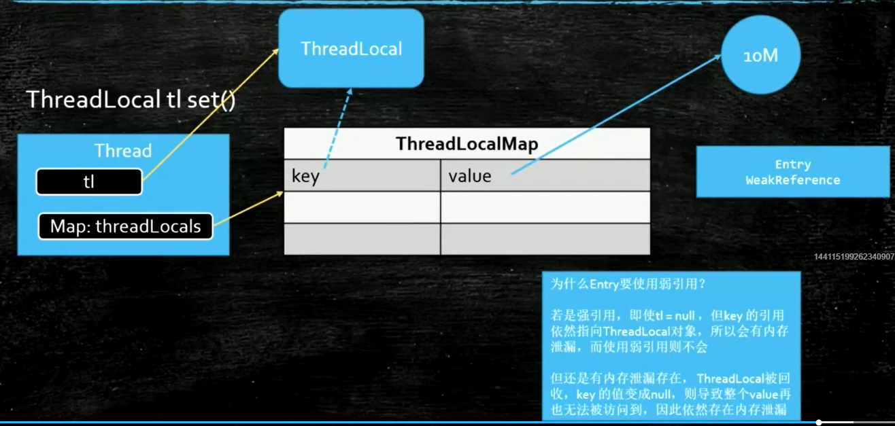

# ThreadLocal

设置值：
map = getMap -> getMap : Thread.currentThread.map  # 这个map是线程Thread的属性,所以我们获取的是当前线程
的Map对象  
map.set(ThreadLocal->this,T->value)
也就说我们使用ThreadLocal的时候，是每个线程都有自己的一个Map对象来存有ThreadLocal对象的属性

用途： 声明式事务，保证多个方法拿同一个Connection对象

牢记：使用ThreadLocal 对象不使用时务必进行remove操作,
```java
public class Test{
    public static void main(String[] args) {
        ThreadLocal<M> threadLocal = new ThreadLocal<M>();
        threadLocal.set(new M());
        threadLocal.remove();
    }
}
```

## 弱引用
WeakReference
弱引用指向的对象会在GC的时候被回收掉  
用处： 当弱引用跟强引用同时指向一个对象A，那么当强引用消失时，由于只有弱引用指向A，那么在GC的时候A就会被回收

用途：
1.容器管理对象
2.ThreadLocal 里面Map的Entry是弱引用的
```java 
   static class Entry extends WeakReference<ThreadLocal<?>> {
            Object value;

            Entry(ThreadLocal<?> k, Object v) {
                super(k);
                this.value = v;
            }
        }
```
使用弱引用是为了防止内存泄露



