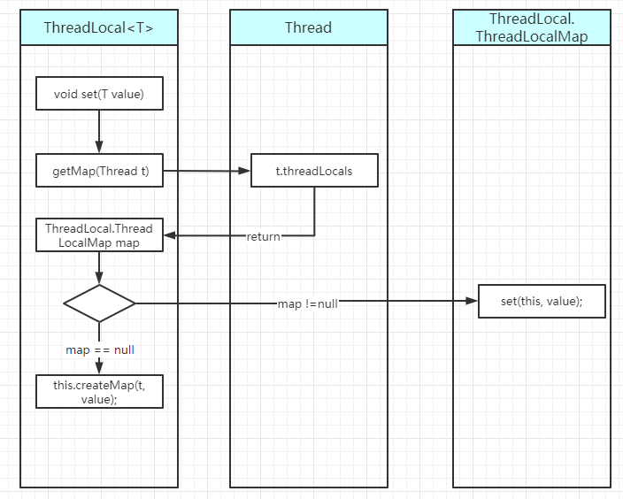
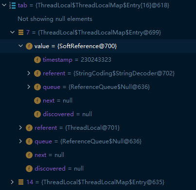

# ThreadLocal

ThreadLocal可以做到 线程之间的数据隔离，即不同线程之间数据是独立的，就像存储在本地的一样。
ThreadLocal是如何实现的这种隔离呢，我们可以先看一下ThreadLocal的两个方法：`get()`,`set(T value)`
```java
public class ThreadLocal<T> {

  public void set(T value) {
    Thread t = Thread.currentThread();
    ThreadLocal.ThreadLocalMap map = this.getMap(t);
    if (map != null) {
      map.set(this, value);
    } else {
      this.createMap(t, value);
    }
  }
  
  public T get() {
    Thread t = Thread.currentThread();
    ThreadLocal.ThreadLocalMap map = this.getMap(t);
    if (map != null) {
      ThreadLocal.ThreadLocalMap.Entry e = map.getEntry(this);
      if (e != null) {
        T result = e.value;
        return result;
      }
    }
    return this.setInitialValue();
  }

  ThreadLocal.ThreadLocalMap getMap(Thread t) {
    return t.threadLocals;
  }
}
```

## set(T value)

设置值 set(T value)：
 1. 获取当前线程t
 2. 以当前线程t为key，获取一个map，这个getMap的方法我们在下面会说到，这里知道获取到map是ThreadLocalMap (ThreadLocal的一个内部类)
 3. 看一下这个map是否为空，如果为空则创建一个map；不为空则设置值
    如果只看这三个步骤，感觉ThreadLocal好像是通过一个map对象，然后以线程作为key，数据作为value。对于同一个ThreadLocal对象来说，
    在不同线程中，获取的值也是线程独有的。
    
那么这里可能就要涉及到几个问题了:
1. 这个map对象如何来保证多个线程同时操作时的安全性
2. 如果说线程只能操作自己key对应的value，那么如何在一个线程结束时，将这个线程对应的value清除。
3. 

先说第一个问题，如何来保证线程各自操作自己的数据：
先看一下get()方法中的getMap(Thread t)： `return t.threadLocals;`。这个方法返回了t的属性threadLocals。
```java
public class Thread implements Runnable {
  ThreadLocalMap threadLocals;
  ThreadLocalMap inheritableThreadLocals;
}
```
threadLocals对象的类型时ThreadLocalMap,ThreadLocal的内部类。所以，我们可以知道每个线程都有一个属性，那么通过getMap方法获得Map对象
实际上就是线程自己的，这样线程之间就互不干涉了。我们可以着重看一下ThreadLocalMap这个类的一些实现。

```java
static class ThreadLocalMap {
  private static final int INITIAL_CAPACITY = 16;
  private ThreadLocal.ThreadLocalMap.Entry[] table;
  private int size = 0;
  private int threshold;

  private void set(ThreadLocal<?> key, Object value) {
    ThreadLocal.ThreadLocalMap.Entry[] tab = this.table;
    int len = tab.length;
    int i = key.threadLocalHashCode & len - 1;

    for(ThreadLocal.ThreadLocalMap.Entry e = tab[i]; e != null; e = tab[i = nextIndex(i, len)]) {
      ThreadLocal<?> k = (ThreadLocal)e.get();
      if (k == key) {
        e.value = value;
        return;
      }

      if (k == null) {
        this.replaceStaleEntry(key, value, i);
        return;
      }
    }

    tab[i] = new ThreadLocal.ThreadLocalMap.Entry(key, value);
    int sz = ++this.size;
    // cleanSomeSlots 这个方法是用来清理Entry[]的值，让其被GC清理掉
    if (!this.cleanSomeSlots(i, sz) && sz >= this.threshold) {
      this.rehash();
    }

  }

  static class Entry extends WeakReference<ThreadLocal<?>> {
    Object value;

    Entry(ThreadLocal<?> k, Object v) {
      super(k);
      this.value = v;
    }
  }
}
```

ThreadLocalMap这个类中有个比较重要的属性： `private ThreadLocal.ThreadLocalMap.Entry[] table;`
这个是一个Entry的数组。我们把value放到这个数组中。放入数组时并非按照顺序直接放入的，而是计算出
`int i = key.threadLocalHashCode & len - 1;` 然后把新的值放入table[i]中。一开始Entry数组被初始化为16.
另外就是因为这个时根据hash值往里面插入，因此可能存在两个key存在冲突，这个还需要对应的解决冲突的办法。

map = getMap -> getMap : Thread.currentThread.map  # 这个map是线程Thread的属性,所以我们获取的是当前线程
的Map对象  
map.set(ThreadLocal->this,T->value)
也就说我们使用ThreadLocal的时候，是每个线程都有自己的一个Map对象来存有ThreadLocal对象的属性
## get()
get方法在了解了ThreadLocal的set方法之后，其实需要注意的地方就只有ThreadLocalMap的getEntry这个方法了。
我们先看一些get()方法都做了那些事：
1. 与set相同，根据当前线程拿到Map
2. 如果map不为空，再根据ThreadLocal对象拿到线程中对应的Entry
3. 如果map为空，则返回设置的初始化值，这个初始化值其实就是null。因为Entry是弱引用类型，所以GC会在没有其他强引用指向Entry对象时，将其回收。
看一下getEntry这个方法的实现。
```java
public class ThreadLocal<T> {

    private ThreadLocal.ThreadLocalMap.Entry getEntry(ThreadLocal<?> key) {
        int i = key.threadLocalHashCode & this.table.length - 1;
        ThreadLocal.ThreadLocalMap.Entry e = this.table[i];
        return e != null && e.get() == key ? e : this.getEntryAfterMiss(key, i, e);
    }

}
```
其实也很简单，就是根据key的hash值算出对应的数组下标i，如果i对应的元素是空的或者是值与给定的key不一样，
那么就会调用解决冲突的方法`getEntryAfterMiss`来找下一个可能的索引。这里是因为在加入这个元素的时候，可能第一次插入时。
对应的位置已经存在元素了，发生了hash冲突。所以，要插入的元素可能被插入到了解决冲突之后的位置。  
    至于`setInitialValue()`方法，其实就是为当前线程初始化ThreadLocalMap这个变量

牢记：使用ThreadLocal 对象不使用时务必进行remove操作,
```java
public class Test{
    public static void main(String[] args) {
        ThreadLocal<M> threadLocal = new ThreadLocal<M>();
        threadLocal.set(new M());
        threadLocal.remove();
    }
}
```

## 基于弱引用
WeakReference
弱引用指向的对象会在GC的时候被回收掉  
用处： 当弱引用跟强引用同时指向一个对象A，那么当强引用消失时，由于只有弱引用指向A，那么在GC的时候A就会被回收

用途：
1.容器管理对象
2.ThreadLocal 里面Map的Entry是弱引用的
```java 
   static class Entry extends WeakReference<ThreadLocal<?>> {
            Object value;

            Entry(ThreadLocal<?> k, Object v) {
                super(k);
                this.value = v;
            }
   }
```
下面的图是`ThreadLocalMap`属性`Entry table`的运行时参数



