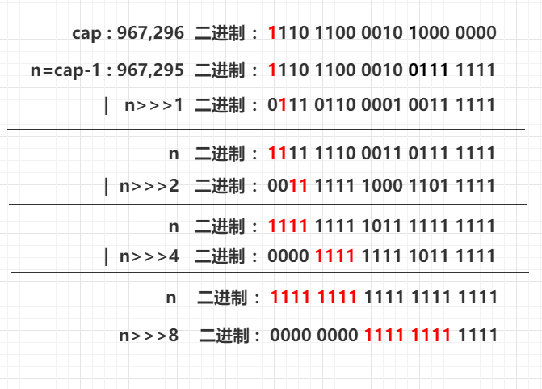

# Map

## HashMap

### 重要属性

- `static final int DEFAULT_INITIAL_CAPACITY = 16;` :默认的数组容量
- `static final int TREEIFY_THRESHOLD = 8;` : 进行红黑树转变的阈值
- `static final int UNTREEIFY_THRESHOLD = 6;` : 由红黑树退化为链表的阈值
- `static final float DEFAULT_LOAD_FACTOR = 0.75F;` : 默认负载因子，扩容阈值 = 容量 * 负载因子
- `MIN_TREEIFY_CAPACITY` : 执行红黑树化的数组最小长度
- `transient HashMap.Node<K, V>[] table;` ： 索引位置数组
- `int threshold;` : 扩容阈值
- `final float loadFactor;` : 负载因子，可以在创建HashMap对象的时候确定
- `transient int size;` : 节点数量

### 数据结构

- 1.7及以前： 数组 + 链表
- 1.8及以后： 数组 + 链表 + 红黑树

1.8增加了红黑树的数据结构，但是并不是一开始插入元素的时候，就构建红黑树，而是在一个元素数量在一个界限之后开始构建红黑树。

- 构建红黑树的界限： 数组容量到达`64`，并且单个链表长度超过`8`,到达`9`。如果只是单个链表长度超过8，但是数组容量并未到64，会进行数组扩容，来减少hash冲突。
- 退化为链表的界限： 某个索引位置的节点个数减少为`6`，并且该索引位置的数据结果为 `红黑树`。就会执行退化链表。

关于`链表`<--->`红黑树`转换的几个问题：

- 为什么链表转红黑树的阈值会选择为8 ： 这一点是综合考虑时间和空间影响因素的情况下确定的，首先使用红黑树所需要的节点数要大于链表的节点数，当某个索引位置的节点数比较少的时候，
  使用红黑树所提升的检索速度并不明显，但是耗费的空间要远大于链表。其次，当某索引位置的节点数较多的情况下，按照链表遍历的时间复杂度为O(n),而使用红黑树遍历的时间复杂度为O(logn)。
- 为什么红黑树退化链表的阈值会选择6，而不是复用8： 如果复用8的话，那么当某索引位置上的节点数在8附近抖动时，会造成数据结构的来回变化，会造成额外的时间消耗。退化阈值设定为6，相当于 流出了一部分缓冲空间，不至于引起数据结构频繁变动。

### 源码

1. 获取数组容量：需求是提供一个`int`参数`cap`,返回一个不小于cap的最小的2的次方数。
    - 自己的思路：设定变量n循环左移，n从1开始，直到大于给定的参数cap。
    - HashMap的思路：-1 无符号右移给定位数。int型的-1转二进制的值为`1111 1111 1111 1111 1111 1111 1111 1111`,无符号右移时，高位补0。无符号右移一位，获得的数就变为正数了。
      那么该如何获取右移的位数呢，代码如下，使用了Integer类的一个方法`numberOfLeadingZeros`，我们可以看一下具体实现。

   ```java
   public class HashMap<K, V> extends AbstractMap<K, V> implements Map<K, V>, Cloneable, Serializable {
   
       /**
        * Returns a power of two size for the given target capacity.
        * 1.7的实现
        * @param initialCapacity 初始化容量
        * @return
        */
       static final int tableSizeFor(int initialCapacity) {
           int capacity = 1;
           while (capacity < initialCapacity) {
               capacity <<= 1;
           }
           return capacity;
       }
   
       /**
        * Returns a power of two size for the given target capacity.
        * @param cap
        * @return
        */
       static final int tableSizeFor(int cap) {
           int n = cap - 1;
           n |= n >>> 1;
           n |= n >>> 2;
           n |= n >>> 4;
           n |= n >>> 8;
           n |= n >>> 16;
           return (n < 0) ? 1 : (n >= MAXIMUM_CAPACITY) ? MAXIMUM_CAPACITY : n + 1;
       }
   
       /**
        * Returns a power of two size for the given target capacity.
        * jdk1.9及以后的实现
        * @param cap
        * @return
        */
       static final int tableSizeFor(int cap) {
           int n = -1 >>> Integer.numberOfLeadingZeros(cap - 1);
           return n < 0 ? 1 : (n >= 1073741824 ? 1073741824 : n + 1);
       }
   
       // Integer的numberOfLeadingZeros方法 
       public static int numberOfLeadingZeros(int i) {
           if (i <= 0) {
               return i == 0 ? 32 : 0;
           } else {
               int n = 31;
               if (i >= 65536) {
                   n -= 16;
                   i >>>= 16;
               }
   
               if (i >= 256) {
                   n -= 8;
                   i >>>= 8;
               }
   
               if (i >= 16) {
                   n -= 4;
                   i >>>= 4;
               }
   
               if (i >= 4) {
                   n -= 2;
                   i >>>= 2;
               }
   
               return n - (i >>> 1);
           }
       }
   }
   ```

   比较三个版本关于`tableSizeFor`的区别：

    1. jdk7 与自己的思路相似，通过与初始化容量做对比，然后不断右移位数，这样思路很简单，但是最坏情况下要移动30位才能符合要求，这样的话效率较低
    2. jdk8 通过`逻辑右移`和`|`操作来不断将n对应的高位设置为1，最后+1得到了不小于n的2的最小幂数
       
       如图所示，在经过 两次`|`和`>>>`运算之后，n的最高有效位的高四位都变成1了，可以得知在经过`n|=n>>>4`和`n|=n>>>8`以及`n|=n>>>16`之后，最高有效位之后的8位，16位，32位都会变成1。
       但这里有个问题，就是当n较小的时候，不需要右移那么多位。虽然这些操作并不会将最高有效位之前的位上的0变为1，但是确实在某种情况下变成了不必要的操作。
       于是在jdk1.9之后，HashMap的`tableSizeFor(int)`
       这个方法就有进行了优化
    3. jdk11(不一定是11开始使用的，只是笔者看的11的源码)使用了`Integer`封装的方法`numberOfLeadingZeros(int)`
       ，这个方法大返回一个右移的位数，我们只需要用-1右移这个位数即可。然后看一下右移之后的数有没有超过限制。对没有超过限制的n做+1操作（这个方法以后在详解）。
       这里需要知道的是，这个方法会根据传值的大小来判断需要移动几位，如果小于65536，也就意味着高16位为0，可能移动的位是低16位。小于256即只有低8位需要移动，前24位都为0.
       这样，在面对较小的正数的时候，不必要对前几位做不必要操作。

2. 关于散列函数`hash()`:

```java
public class HashMap<K, V> extends AbstractMap<K, V> implements Map<K, V>, Cloneable, Serializable {
    static final int hash(Object key) {
        int h;
        return key == null ? 0 : (h = key.hashCode()) ^ h >>> 16;
    }
}
```