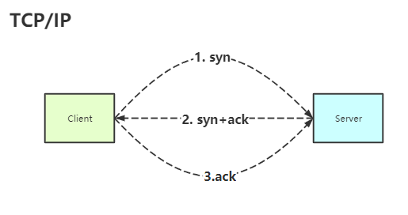
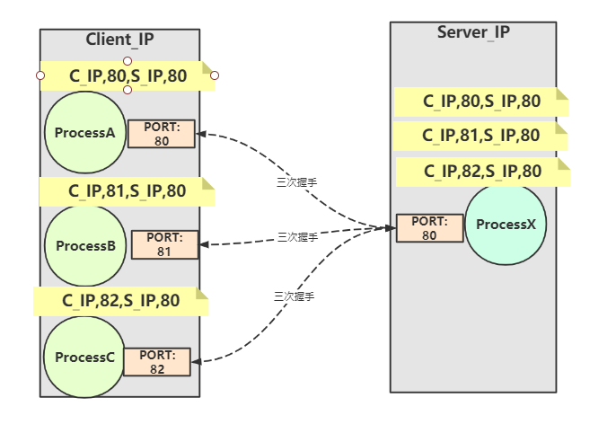
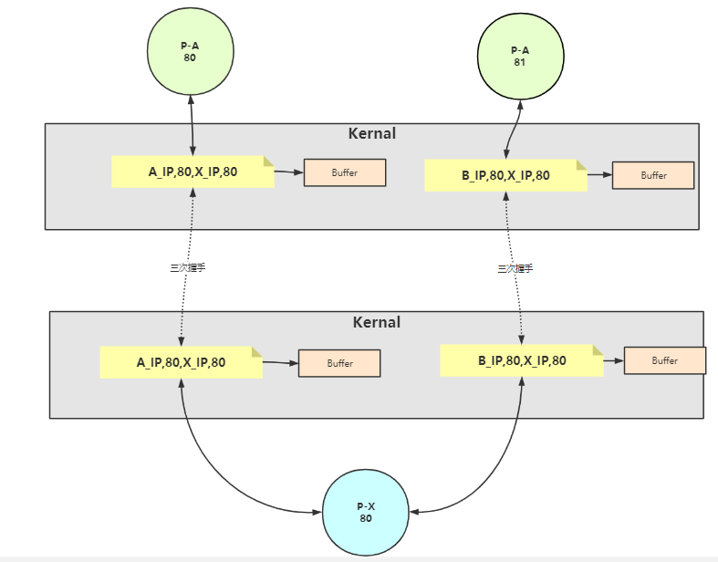

# Java IO

### BuffedIO与普通IO 谁更快

BufferIO更快，8K的数据缓冲区.

- ByteBuffer:
  三个指针： pos:读写指针，读写操作开始的指针 limit:读操作时，lim会指向有效数据的最后一位。写操作时，lim=cap cap:buffer分配的内存区容量

## TCP/IP

面向连接的，通信安全的网络协议。

### 三次握手

当客户端与服务器建立连接前需要经过三次握手，来确认通信状态安全。

1. 客户端->服务端发送 `syn`
2. 服务端收到后，向客户端回复`syn + ack`
3. 客户端收到服务端的回复之后，再次向服务端发送确认信号`ack`

三次握手之后，双方可以建立连接了。生成socket，双方在各自的内核空间为此次连接开辟缓冲区`Buffer`。

### Socket

Socket的实质是一个四元组：{ Client_IP,Client_PORT,SERVER_IP,SERVER_PORT }。

- IP: Client_IP与SEVER_IP是标志通信双方主机的
- PORT: Client_PORT与SERVER_PORT标记通信的进程

Socket生成的四元组具有唯一性，这四个字段唯一标识一个通信连接。

注： 1. 一个进程可以与多个不同的进程建立通信连接，只要建立连接的Socket四元组不同即可。

