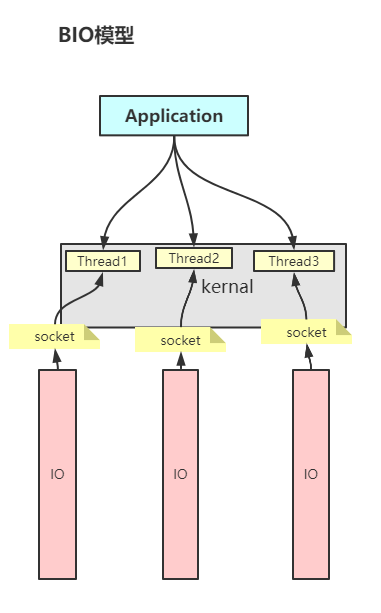
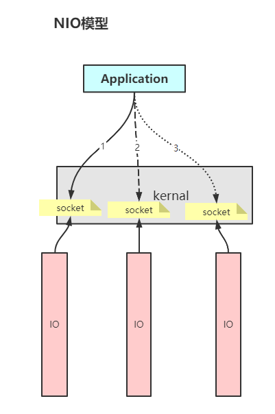
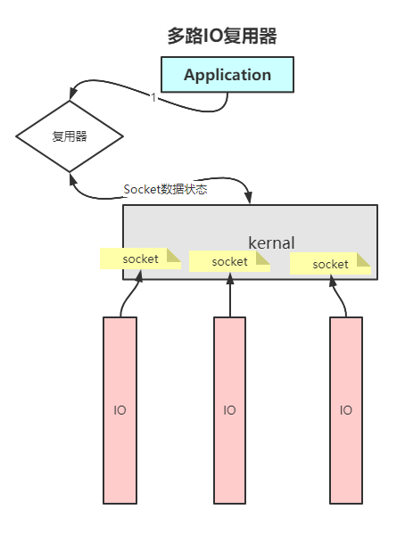

# Java IO

### BuffedIO与普通IO 谁更快

BufferIO更快，8K的数据缓冲区.

- ByteBuffer:
  三个指针： pos:读写指针，读写操作开始的指针 limit:读操作时，lim会指向有效数据的最后一位。写操作时，lim=cap cap:buffer分配的内存区容量

## TCP/IP

面向连接的，通信安全的网络协议。

### 三次握手

当客户端与服务器建立连接前需要经过三次握手，来确认通信状态安全。

1. 客户端->服务端发送 `syn`
2. 服务端收到后，向客户端回复`syn + ack`
3. 客户端收到服务端的回复之后，再次向服务端发送确认信号`ack`

三次握手之后，双方可以建立连接了。生成socket，双方在各自的内核空间为此次连接开辟缓冲区`Buffer`。

### Socket

Socket的实质是一个四元组：{ Client_IP,Client_PORT,SERVER_IP,SERVER_PORT }。

- IP: Client_IP与SEVER_IP是标志通信双方主机的
- PORT: Client_PORT与SERVER_PORT标记通信的进程

Socket生成的四元组具有唯一性，这四个字段唯一标识一个通信连接。

注： 1. 一个进程可以与多个不同的进程建立通信连接，只要建立连接的Socket四元组不同即可。

当两个进程进行通信的时候，会生成一个Socket(唯一的四元组)被通信双方分别持有，同时会在内核内存区为本次会话开辟一个内存缓冲区。 该缓冲区用于接受对方传过来的数据。
另外，当我们在程序级别创建了一个Socket的连接，但是没有调用`accept()`方法时，OS依旧会在内核层面为进程做好相应的准备，开辟好缓冲区。 只不过不为本次连接分配进程号。即使我们不调用 `accept()`
方法，也可以接收对方发来的消息，这些消息存在缓冲区中，当缓冲区满时，再发消息就会 被丢弃掉。此时我们调用`accpet()`，会读取缓冲区中已缓存的数据。

## 网络IO变化模型

不管是什么网络IO模型，在进程的中都会执行以下系统调用：

1. fd1 = socket()  // 调用socket，返回socket的文件描述符fd1
2. bind(fd1,port)  // 将socket的文件描述符与端口进行绑定
3. listen(fd1)     // 绑定好之后就可以通过socket文件描述符来监听端口接受的消息了

另外在建立通信连接的时候会创建两个socket：

1. 在一开始创建一个服务端的Listen Socket, 经过三次握手之后将这个Socket传给服务端，由`accept(fd` 获得
2. 连接的Socket,连接后进行数据读写使用。

### BIO

BIO在基础上，会有个阻塞的`accept(fd1,` 这里等客户端传过来消息才会继续执行。 同时在接收数据的时候`recv(fd1` 也会阻塞，数据接收时的阻塞决定了BIO必须创建多个线程来接收多个IO请求的数据。
如果在一个线程内内处理多个IO请求，很可能是第一个IO请求连接之后，没有发数据，导致线程阻塞在`read()`方法上，然后其它IO请求无法建立连接（程序级别的，OS级别上会建立连接，但是不分配进程号）。  

- BIO的缺点：需要创建大量线程去处理IO请求，其根本原因是阻塞造成的

### NIO

NIO,在OS系统上指的是`NONBLOCKING IO`，非阻塞IO。在Java上指的是`New IO`，新的IO读写方式，引入了`Channel`等来提高IO速率。  
我们这一次主要关注IO模型，即关注`NONBLOCKING IO`。 相比于BIO,NIO在通信过程中需要阻塞的地方不再继续阻塞，而是根据不同情况来返回不同的值。

- accent(fd): 通过三次握手之后建立连接的Socket,在没有Client连接进来的时候返回`-1`
- recv(fd): 用于数据读写的连接Socket，在没有数据来的时候会返回 `-1`。

虽然连接的建立和数据接收不再被阻塞，但是这就要求我们需要对建立的连接进行遍历来确定哪个连接传过来了数据。因此，NIO的过程大概如下：
接收请求，将请求加入队列->遍历队列，查看请求是否发送了数据。  

- NIO的优点：可以在一个或几个线程内处理N个IO请求，不需要每个IO请求都启用新的线程来处理
- NIO的缺点：对于所有的Client连接，NIO必须每次进行`全量`遍历，才能知道那些请求发送了数据。而其中可能只有少数请求真正发送了数据，因此`全量遍历`会进行大量无效的操作。
  当我们的连接数越多，这种无效操作可能也就越多。另外这种全量遍历时会对每个socket都执行`recv`系统调用，而系统调用的开销比较大，当然`recv`操作是必须的，不进行该操作就无法获取到
  数据，但是无效的`recv`是对系统资源的浪费。

### 多路IO复用器

知道了NIO的弊端在于全量遍历连接进来的socket，那么只要对Client的连接进行精准遍历，让有数据的socket调起`recv`方法就可以解决该问题了。对于程序来说，他如果不进行`recv`其实不知道client连接有没有数据传过来。
但是对于OS的kernel来说，它可以知道每个IO请求是否有数据到来（中断？信号？）。因此我们只需要让Application去问OS，哪个连接有数据传过来，得到连接的状态，就可以只遍历有数据过来的连接了。  

注： 
- 多路是指多个IO请求，复用是指一个kernel程序去监听多个IO请求
- 复用器只获取连接的数据状态，不获取数据，Application得到数据状态之后，自己去读取数据，这是一个同步的模型。

select /poll/epoll
- select(fd)/poll(fd)
- epoll: 省略了内核对fd全量遍历的过程

## 基本概念
- 同步： 程序亲自去读数据
- 异步： kernel来读取数据，返回给程序
- 阻塞： 在建立请求、接受数据动作未完成时，阻塞线程,等待动作完成时才返回
- 非阻塞： 执行动作不一定需要完成，如果暂时没有请求或者数据，则返回-1来告诉程序继续往下走

## 三次握手，四次分手
 

