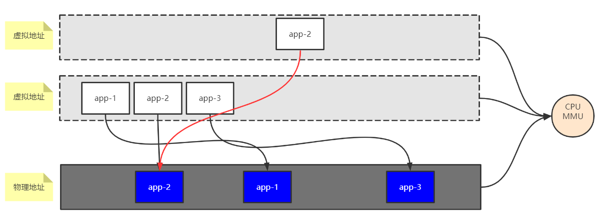

# 系统IO
以Linux为例
## 虚拟文件系统 
任何程序都有 三种文件描述符：0->标准输入 1->标准输出 2—>报错输出
`/proc`该文件夹下包含了所有正在运行的程序的pid

### 虚拟内存空间

一个虚拟内存空间包括以下几部分：
 1. 内核空间： 存放内核的代码和数据，所有程序的内核地址部分都是共享了同一块物理内存内核的地址。
 2. 代码段： 存放程序所要运行的代码
 3. 数据段： 程序运行时的数据部分
 4. 堆空间： 
 5. 栈空间：  

注： 堆空间和栈空间是反向生长的，一个向高地址部分增长，一个向低地址部分增长，这样最后两者会碰到一起，这样内存就满了。  
实际的物理内存只有一块，而操作系统通过虚拟地址让每个进程都认为自己独占了内存空间。

## 内存映射
OS为程序提供的虚拟内存中，程序的运行的地址是连续，但是这些连续的地址在物理内存中并不一定也是连续的。
因此，OS需要提供一个从虚拟地址映射到物理地址的运算单元：MMU(内存逻辑单元)。
  

## page cache

