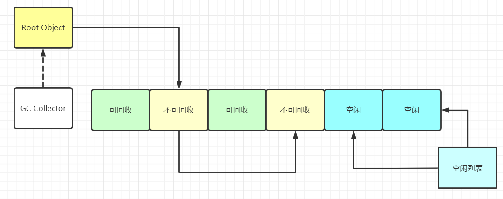
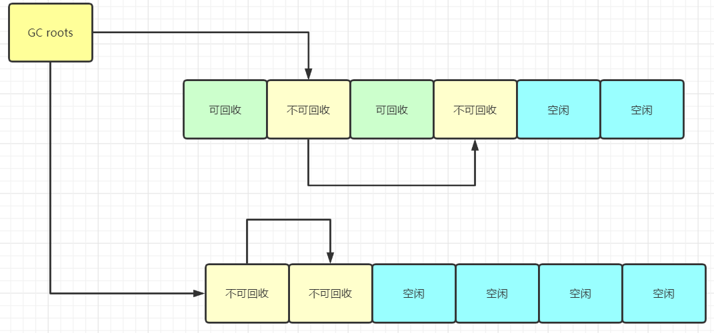
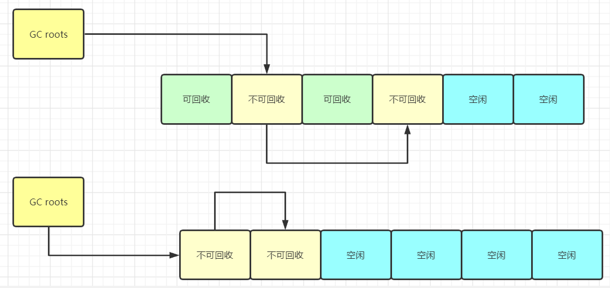
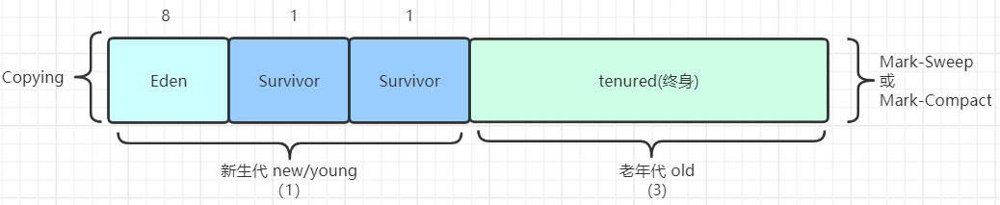
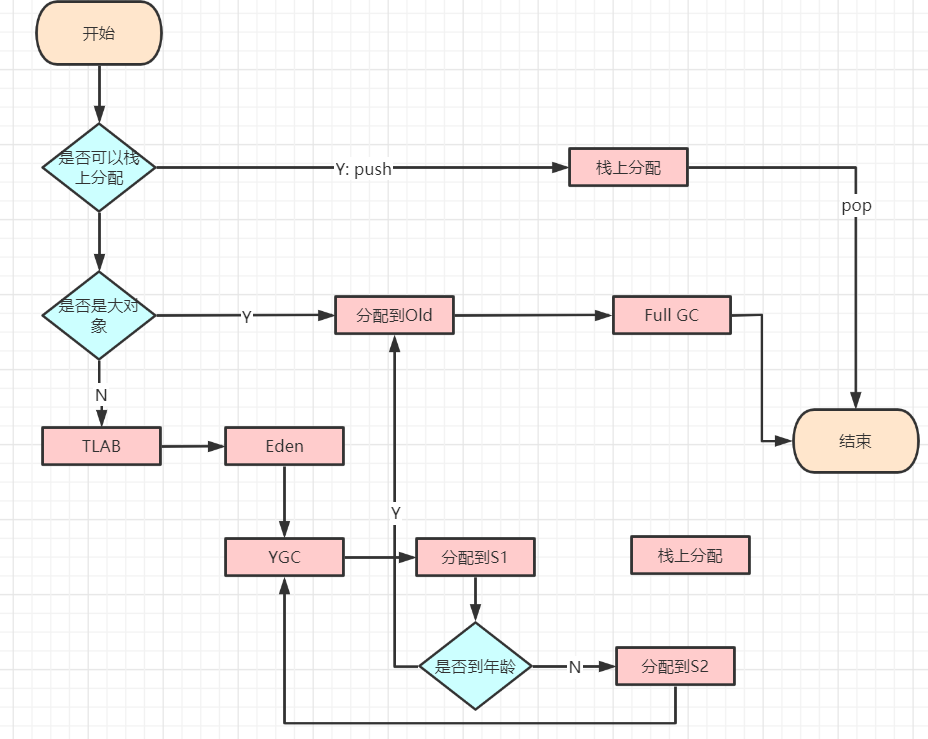

# GC(Garbage Collector) 垃圾回收

垃圾： 没有引用指向的对象  
C/C++使用手动回收，可能遇到的问题：忘记回收、回收多次

### 定位垃圾的算法

1. 引用计数 (reference count)： 每个对象都是用计数器来记录引用数， 无法解决循环引用问题
2. 根可达算法 ()： 根对象包括
    - `线程栈变量`,线程栈是指运行时内存中线程调度的栈信息；
    - `静态变量`，静态变量属于类，而非对象，当类被回收时，静态变量才会被回收，因此静态变量指向的对象为根对象
    - `常量池`，常量池中指向的类的对象
    - `JNI指针`， 调用本地方法(C/C++),所涉及的对象

## 常见的垃圾清除算法

- Mark—Sweep (标记清除)： 将垃圾标记出来，然后GC时进行清理。 （不适合Eden区）
  
    1. 算法比较简单，在存活对象比较多的时候效率较高。
    2. 问题是，两遍扫描，第一遍找出有用的对象，第二遍找出垃圾进行清理，效率较低；对回收的内存不压缩、不整理，容易产生碎片。
- Copying(拷贝)： 在进行垃圾回收时，将不可回收的内存拷贝到一块内存区域，之后将可回收的清理掉。（适合Eden区）  
  注，Copying算法将内存分为两块，每次GC时都将正在使用的区域中的不可回收的块复制到另一个区域，下次GC再复制回去。
  
    1. 适用于存活对象较少的情况，只扫描一次，提高效率
    2. 空间浪费，移动复制对象，需要调整对象的引用指向

- Mark-Compact (标记压缩)： 扫描内存，找出不可回收的，第二遍将不可回收的区域移动到相近的内存区域
  
  1. 不会产生内存碎片，也不会产生可用内存减半问题
  2. 需要扫描两次，且存在对象移动问题，效率较低

## 常见的垃圾回收器
1. 部分垃圾回收器使用的模型：
>  除Epsilon,ZGC,Shenandoah之外的GC都是逻辑分代
> G1是逻辑分代，物理不分代
> 其他既是逻辑分代，又是物理分代
2. 堆内存逻辑分区 （只适合分代模型）

   - Eden: new对象时候进行分配的区域
   - Survivor: 进行一次GC如果没有被回收就会从S1->S2,在进行一次GC没被回收就会从S2->S1。这里参考`Copying`的回收算法流程。
    另外，最多进行15次GC,依旧没有回收就会放入老年代。15这个次数，参考对象头中关于分代字段的长度
   - tenured： 如果一个对象在经历过多次GC之后没有被回收，那么进入tenured
    
一个对象从产生到消亡的内存经历： 
1. 首先尝试进行栈上分配，如果分配不下，则分配到eden区
2. eden区的对象在经历过一次GC之后会进入S1
3. Survivor区的对象每经历一次GC就会向另一个区移动，应该是根据`Copying`GC算法的特点决定的。
4. CMS中在经历过6次GC之后，对象就会进入老年代；G1经历15次会进入老年代

- MinorGC/YGC ： 年轻代空间耗尽时触发
- MajorGC/FullGC ： 老年代无法继续分配空间时出发，年轻代与老年代同时进行GC 
    
### 对象分配
- 栈上分配
    1. 线程私有**小**对象
    2. 无逃逸：当一个对象只在一个方法内部使用时，没有方法外部的变量指向它，那么该对象就是没有逃逸出方法
    3. 支持标量替换
    4. 这里无需调整（调优不需要）
    
- 线程本地分配TLAB (Thread Local Allocation Buffer) 一个线程内的对象分配时，优先往TLAB上分配
    1. 占用eden区，默认1%
    2. 多线程时不需要竞争eden区，在自己的本地内存上进行分配即可，提高效率
    3. 小对象
    4. 无需调整
    
- 老年代： 大对象分配时，会分配到老年代
- eden

### 对象进入老年代
- 超过`XX:MaxTenuringThreshold`的指定次数 （YGC） 最大指定15次
 1. Parallel Scavenge 15次
 2. CMS 6次
 3. G1 15次
- 动态年龄：当对象从(Eden+S1)->S2超过S2区域的50%时，将年龄最大的对象放入老年代

## JVM调优经验

