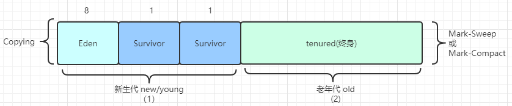

# GC(Garbage Collector) 垃圾回收

垃圾： 没有引用指向的对象  
C/C++使用手动回收，可能遇到的问题：忘记回收、回收多次

GC只发生在堆内存，栈内存当对象一旦被抛出栈就自动回收释放了。

堆： 新生代+老年代  
堆之外的空间： Method Area,1.7实现是Permanent Generation（永久代），1.8及以后是MetaSpace(元数据区)   
字符串常量：1.7放在Method Area ; 1.8放到了堆里面

- 新生代： Eden区+2个Survivor区
    1. YGC回收之后，大多数对象被回收，没有被回收的对象进入S0
    2. 再次YGC之后，Eden区和S0区活着的对象-> S1
    3. 在进行一次YGC,Eden区和S1区活着的对象-> S0
    4. 年龄足够，进入老年代（一般15，CMS是6次）
    5. S区装不下的对象也会分配到老年区

### 定位垃圾的算法

1. 引用计数 (reference count)： 每个对象都是用计数器来记录引用数， 无法解决循环引用问题
2. 根可达算法 ()： 根对象包括
    - `线程栈变量`,线程栈是指运行时内存中线程调度的栈信息；
    - `静态变量`，静态变量属于类，而非对象，当类被回收时，静态变量才会被回收，因此静态变量指向的对象为根对象
    - `常量池`，常量池中指向的类的对象
    - `JNI指针`， 调用本地方法(C/C++),所涉及的对象

## 常见的垃圾清除算法

- Mark—Sweep (标记清除)： 将垃圾标记出来，然后GC时进行清理。 （不适合Eden区）
  
    1. 算法比较简单，在存活对象比较多的时候效率较高。
    2. 问题是，两遍扫描，第一遍找出有用的对象，第二遍找出垃圾进行清理，效率较低；对回收的内存不压缩、不整理，容易产生碎片。
- Copying(拷贝)： 在进行垃圾回收时，将不可回收的内存拷贝到一块内存区域，之后将可回收的清理掉。（适合Eden区）  
  注，Copying算法将内存分为两块，每次GC时都将正在使用的区域中的不可回收的块复制到另一个区域，下次GC再复制回去。
  
    1. 适用于存活对象较少的情况，只扫描一次，提高效率
    2. 空间浪费，移动复制对象，需要调整对象的引用指向

- Mark-Compact (标记压缩)： 扫描内存，找出不可回收的，第二遍将不可回收的区域移动到相近的内存区域
  
    1. 不会产生内存碎片，也不会产生可用内存减半问题
    2. 需要扫描两次，且存在对象移动问题，效率较低

## 常见的垃圾回收器

分代的垃圾回收器：

- JDK诞生的时候，Serial就追随了，为了提高效率，诞生了PS,为了配合CMS，诞生了PN。CMS是JDK1.4后期引入， 是里程碑式的GC,CMS开启了并发回收的过程，但CMS的毛病较多.   
  并发回收的原因是因为无法忍受STW，即使是多线程，STW的时间也比较长 Serial/Serial Old：单线程的 Parallel/Parallel Old:多线程的
- CMS JDK8及之前
- G1: JDK9 G1仅在逻辑上分为年代和老年代，物理上不分代。
- Serial,Parallel,ParNew,CMS,Serial Old,Parallel Old 在逻辑和物理上均分代。
- STW: stop the world 将所有应用线程停止

常见的三种组合：

1. Serial + Serial Old  
   
    1. Serial ： a stop-the-world, copying collector which use a single GC Thread
    2. Serial Old : a stop-the-world Mark-sweep-compact collector which use a single GC Thread

    - safe point: 安全点，线程停止需要一个过程，因此需要在一定的时间点保证全部线程都停止
    - 停顿时间： 用于GC thread
      `Serial`和`Serial Old` 模式相同，只不过使用不同的垃圾回收算法，一个是`Copying`,一个是`Mark-Sweep/Mark-Compact`。 相应的，它们的工作区也不一样，`Serial`
      工作在年轻代，而`Serial Old`工作在老年代。

2. Parallel Scavenge+ Parallel Old (PS+PO): 默认情况下的垃圾回收器
   
    1. Parallel Scavenge: a stop-the-world, copying collector which use multiple GC Threads
    2. Parallel Old:  a compact collect which use multiple GC threads

3. ParNew + CMS ：
    1. ParNew: 在Parallel Scavenge基础上做了一些增强，来适合CMS
    2. CMS：concurrent mark sweep  
       

    - 初始标记：标记根对象，STW
    - 并发标记：占GC的大部分时间
    - 重新标记：标记 第二个阶段产生的垃圾
    - 并发清理：会产生浮动垃圾 CMS的问题：1. 内存碎片化，不进行压缩整理 2. 浮动垃圾 CMS-Serial Old：即当CMS无法GC时，老年代的垃圾回收器就会退化为Serial Old；  
      由于CMS在老年代使用的GC算法是`Mark-Sweep`,这种算法会带来内存碎片，CMS在GC之后如果老年代因为较多的内存碎片，使年轻代的对象无法进入老年代（有空间，但是由于碎片化，无法引入对象）。
      这时候，即使CMS在进行GC也无法在老年代整理出足够的空闲空间来，这样就会调用`Serial Old`使用`Mark-Compact`算法，来进行整理压缩。但是`Serial Old`是单线程的垃圾回收器，如果在内存较小的时候
      单线程的GC Collector还可以在较短时间内对老年代内存进行整理。但是一旦内存较大，单线程的整理压缩时间就长的让人难以忍受。  
      当日志中出现`Concurrent Mode Failure`或者是`PromotionFailed`的时候，就说明CMS在GC过程中产生了大量的内存碎片了。  
      避免方式：降低阈值，-XX:+CMSInitiatingOccupancyFraction (1.8默认是92%，可以降低，是)
4. G1(Garbage First Garbage Collector,垃圾优先，分而治之):只回收部分垃圾来减少停顿时间。 G1的目标是在**多核**，**大内存**的机器上，在大多数情况下可以实现指定的GC暂停时间，同时还能保持较高的吞吐量
   
- 特点：
    1. 并发收集
    2. 压索空闲空间不会延长GC的停顿时间
    3. 更容易预测GC的停顿时间
    4. 适合不需要很高吞吐量的场景
      
- Region（块）： G1的每个区域不是固定的年轻代或老年代，每个Region可能是年轻代，也可能是老年代，但在某一时刻一定只属于一个代。
- 基本概念： 
    1. CSet: Collection Set,一组可被回收的分区集合。在CSet存活的数据会在GC过程中被移动到另一个可用分区，CSet中的分区可能来自Eden，Survivor或者是Old区。
    2. `RSet(重点)`: RememberedSet，每个Region中都存在一个RSet(本质上是hashmap)，记录其他Region中的对象到本Region的引用，RSet的作用在于`使得垃圾回收器在进行GC时不必要扫描整个堆来找到哪些对象引用了当前Region的对象，只需要扫描RSet即可`    
    3. CardTable: 由于在进行YGC的时候，可能会存在由Old区指向年轻代的对象，如果每次YGC都去扫描整个Old区，效率是很低的。因此，在这里对Old区进行划分，分成一个个的Card。
        当Card所代表的内存中由对象指向年轻代，那么就在一个BitMap中吧这个card所代表的位标记。这样每次YGC只要扫描BitMap中被标记为dirty的card就行了。
       
- 新老年代比例：动态的，不需要手工指定（也不要手工指定，这个是G1预测STW的基准），一般在5%-60%
- Humongous Object，超过单个Region的50%的对象以及跨越多个Region的对象，超大对象。
- GC触发时间：
    - YGC： 
        1. Eden区内存不足
        2. 多线程并发执行
    - FGC： G1也会产生FGC,当内存不足以分配对象时触发
- 如果G1触发了FGC，解决策略：
    1. 扩内存
    2. 提高CPU性能（提高回收速度）
    3. **降低MixedGC的触发阈值**，让MixedGC提前发生。MixedGC相当于一次CMS(1. 初始标记，2. 并发标记，3. 重新标记 4. 筛选(并发)回收，回收垃圾最多的Region)
    
    
5. ZGC：
6. Shenandoah

1. 部分垃圾回收器使用的模型：

> 除Epsilon,ZGC,Shenandoah之外的GC都是逻辑分代
> G1是逻辑分代，物理不分代
> 其他既是逻辑分代，又是物理分代

2. 堆内存逻辑分区 （只适合分代模型）
   
    - Eden: new对象时候进行分配的区域
    - Survivor: 进行一次GC如果没有被回收就会从S1->S2,在进行一次GC没被回收就会从S2->S1。这里参考`Copying`的回收算法流程。
      另外，最多进行15次GC,依旧没有回收就会放入老年代。15这个次数，参考对象头中关于分代字段的长度
    - tenured： 如果一个对象在经历过多次GC之后没有被回收，那么进入tenured

一个对象从产生到消亡的内存经历：

1. 首先尝试进行栈上分配，如果分配不下，则分配到eden区
2. eden区的对象在经历过一次GC之后会进入S1
3. Survivor区的对象每经历一次GC就会向另一个区移动，应该是根据`Copying`GC算法的特点决定的。
4. CMS中在经历过6次GC之后，对象就会进入老年代；G1经历15次会进入老年代

- MinorGC/YGC ： 年轻代空间耗尽时触发
- MajorGC/FullGC ： 老年代无法继续分配空间时出发，年轻代与老年代同时进行GC

### 对象分配

- 栈上分配
    1. 线程私有**小**对象
    2. 无逃逸：当一个对象只在一个方法内部使用时，没有方法外部的变量指向它，那么该对象就是没有逃逸出方法
    3. 支持标量替换
    4. 这里无需调整（调优不需要）

- 线程本地分配TLAB (Thread Local Allocation Buffer) 一个线程内的对象分配时，优先往TLAB上分配
    1. 占用eden区，默认1%
    2. 多线程时不需要竞争eden区，在自己的本地内存上进行分配即可，提高效率
    3. 小对象
    4. 无需调整

- 老年代： 大对象分配时，会分配到老年代
- eden

### 对象进入老年代

- 超过`XX:MaxTenuringThreshold`的指定次数 （YGC） 最大指定15次

1. Parallel Scavenge 15次
2. CMS 6次
3. G1 15次

- 动态年龄：当对象从(Eden+S1)->S2超过S2区域的50%时，将年龄最大的对象放入老年代
- 分配担保： YGC期间，Survivor区内存不够，有新的对象进来的话，通过空间担保直接进入老年代
  

> 获取JVM的参数： java -XX:+PrintFlagsFinal 获取所有非标参数，大概有七八百个，为了更准确的找相关的参数  
> 我们可以使用 java -XX:+PrintFlagsFinal | findstr xxx

## Concurrent Mark（并发标记）阶段的算法：

1. ZGC会使用染色指针来标记每个对象的状态（四位对应四个状态） + 读屏障。
2. G1使用三色标记+SATB
3. CMS使用三色标记+Incremental Update

### 三色标记算法：
    - 白色： 未被标记的对象
    - 灰色： 自身已经标记，但是成员变量还未被标记
    - 黑色： 自身和成员变量都被标记过 
  
A： 自身与其成员变量的指向的对象都被标记过  
B,C： 自身被标记过，但是成员变量指向的应用没有被标记过  
D: 自身也没有标记过

1. 漏标的充分必要条件：
    - 在Remark的过程中，一个黑色对象的引用指向了白色对象。
    - 原来指向这个白色对象的引用消失了。
    
  
如图所示，A指向了D,而B指向D的引用消失。那么D作为一个没有被标记过的对象，就无法再次标记了。因为A已经为黑色了。  
解决漏标的问题，只要打破两个条件即可。  
1. incremental update (CMS 使用该方式) : 增量更新，关注引用的增加，当黑色的对象有引用指向白色的时候，把黑色对象标记为灰色。
2. SATB (snapshot at the beginning,G1使用SATB，与RSet相配合): 关注引用删除，当B->D消失的时候，要把这个引用推到GC的堆栈中，确保还能扫描到D

# JVM调优经验

## 常见的垃圾回收器组合参数设定

- -XX:+UseSerialGC : Serial New + Serial Old
    - 小型程序，默认不会是这种选择，HotSpot会根据计算机配置和Jdk版本来选择垃圾回收器

- -XX:+UseConc(urrent)MarkSweepGC : ParNew + CMS +Serial Old
- -XX:+UseParallelGC : Parallel Scavenge + Parallel Old(1.8默认) 【Parallel Scavenge + Serial Old】
- -XX:+USeParallelOldGC : Parallel Scavenge + Parallel Old
- -XX:+UseG1GC : G1 GC

### JVM常用命令行参数

- HotSpot参数分类：

> 标准参数： - 开头 所有HotSpot版本都支持  
> 非标准参数: -X 开头 部分HotSpot版本可能不支持  
> 不稳定参数： -XX 开头 下个版本可能就废除了

### 常用的JVM命令：

- -XX:+PrintCommandLineFlags  : 查看JVM开启的基本参数
- -Xmn[10M]:指定新生代大小 -Xms[40M]：最小的堆大小，-Xmx[40M]:最大的堆大小 注：一般来说，将最小堆大小与最大堆大小设为相同值，防止因为对内元素变化带来的堆的收缩与扩张。
- 打印GC信息
    1. -XX:+PrintGC ClassName : 打印GC信息
    2. -XX:+PrintGCDetails ：打印GC的细节
    3. -XX:+PrintGCTimeStamps : 打印GC发生的时间戳
    4. -XX:+PrintGCCauses: 打印GC发生的原因

### 调优基础概念

- 吞吐量: 用户代码执行时间/(用户代码执行时间+GC时间）
- 响应时间： STW越短，响应时间越短

调优首先确定调优的目标：吞吐量优先？响应时间优先？均衡？

1. 吞吐量优先的（一般）： 垃圾回收器使用PS+PO
2. 响应时间优先（一般）：垃圾回收器使用ParNew+CMS/G1（优先）

### 什么是调优

1. 根据需求进行JVM规划和预调优
2. 优化运行JVM运行时环境
3. 解决JVM运行过程中出现的各种问题（比如OOM）

### 预规划

- 针对业务场景进行调优，没有实际的业务场景谈不上调优。并发：TPS/QPS
- 无监控，不调优：监控压力测试，可以看到结果
- 步骤：
    1. 熟悉业务场景：追求吞吐量还是追求响应时间
    2. 选择垃圾回收器组合
    3. 计算内存需求（经验值 1.5G->16G,反而性能下降了，）
    4. 选定CPU(越高越好)
    5. 设定年代大小，升级年龄
    6. 设定日志参数
       > -Xloggc:/opt/xxx/logs/xxx-xxx-gc-%t.log : %t 按照系统时间产生  
       -XX:+UseGCLogFileRotation  :循环使用  
       -XX:+NumberOfGCLogFile=5   :GC日志文件个数  
       -XX:+GCLogFileSize=20M  :每个GC文件大小为20M -XX:+PrintGCDetails  :打印GC细节  
       -XX:+PrintGCDateStamps :打印GC时间戳  
       -XX:+PrintGCCause :打印GC原因

    7. 观察日志情况

### 优化JVM环境

1. 案列：50万PV的资料类网站（磁盘提取资料到内存），原服务器32位，1.5G的堆。用户反应响应时间长。 现在优化为64位服务器，16G的堆，优化完成之后响应时间却变得更长了，请分析原因：
    1. 原服务器响应时间长的原因: 频繁用户访问，大量资料对象从服务器被加载到内存，堆较小，会产生频繁GC,STW时间增加。
    2. 更卡顿的原因： 内存越大，FGC时间越长。扩大内存之后，FGC频率会降低，但是进行FGC的时间会增长。
    3. 如何调优：PS+PO 换成ParNew+CMS/G1。引入并发GC

2. 一个系统CPU->100%，内存突然增大，如何定位？
    1. CPU->100%原因：存在线程占用系统资源，1. 找出CPU高的进程 2. 该进程中的哪个线程CPU占用高，3. 查看该线程的堆栈 4. 根据栈帧找出具体方法  
       JVM命令：1. `top` 2. `top -Hp` 3. `jstack` 4. `jstack`

    2. 内存飙高： 找出堆内存`jmap`,分析（`jhat`,`jvisualvm`,`mat`,`jprofiler`...）

    - top命令观察到问题：内存不断增多，CPU占用居高不下
    - top -Hp 观察进程中的线程，看哪个线程的CPU和占用比高
    - jps 定位具体java进程，jstack定位线程状况，重点关注：[WAITING BLOCKED]  
    eg: waiting on<0x0000020003124213> (a.java.lang.Object)
      假如；存在100个线程中，其中很多线程都在waiting lock ,那么可能由于线程之间的资源争夺导致发生了`死锁`。首先要找到是哪个线程持有了其他线程正在等待的`锁对象`
       
### jconsole远程连接    
1. 程序启动加入参数： java自带的远程监控组件 jmx
   > java -Djava.rmi.server.hostname=xx.xx.xx.xx -Dcom.sun.management.jmxremote 
   > -Dcom.sun.management.jmxremote.port=[port]
   > -Dcom.sun.management.jmxremote.authenticate=false
   > -Dcom.sun.management.jmxremote.ssl=false
   
### jvisualvm 远程连接

### 如何定位OOM问题
- 不要回答用图形节目，jmx的远程监控对工作线程的影响比较大。
    1. 不用图形界面，用什么： cmdline arthas(阿里的组件)
    2. 图形化节目有用吗？测试可以用图形界面进行监控
    
1. `jmap -histo PID | head -20` 查找前20个占用内存最高的进程。  （这个命令对进程的影响相对较小）
   
2. `jmap -Dump:format=b,file=xxx pid/jmap -histo`（这个命令对进程的影响很大，不建议在线上使用）
   但是这个命令有个坑：如果线上系统的内存比较大，在jmap执行期间，可能会对进程产生较大影响，甚至卡顿（不适合电商）。
   1. 设定了参数HeapDump： 在OOM的时候会自动产生`堆转储文件`  到处堆转储文件的命令：
   2. 做了服务器备份（高可用），停掉一台服务器对整个系统影响不大
   3. 在线定位 `arthas`
    
## arthas 
常用命令：
0. help: 查看命令帮助
1. jvm：查看虚拟机参数，可以看GC信息
2. heapdump: 相当于`jamp -Dump:`
可以使用Mat/jhat/jvisuavm 来分析dump文件，可以使用`OQL`来查找特定的问题对象
   
- arthas的反编译和热替换
    1. jad反编译：1. 动态代理生成类的问题定位 2. 第三方的类（观察代码） 3. 确定最新提交的版本是否被使用
    2. redefine热替换： 目前有些限制（只能修改方法内容，不能修改方法名和属性） 
