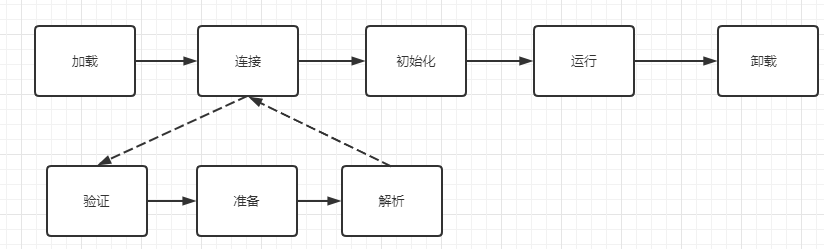
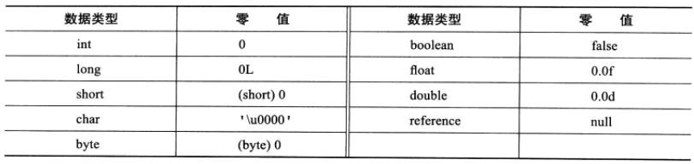
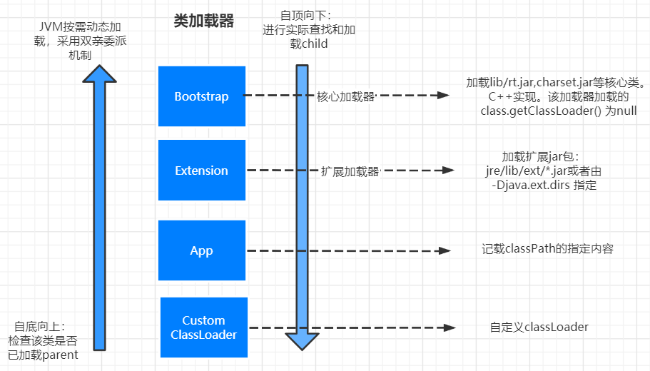
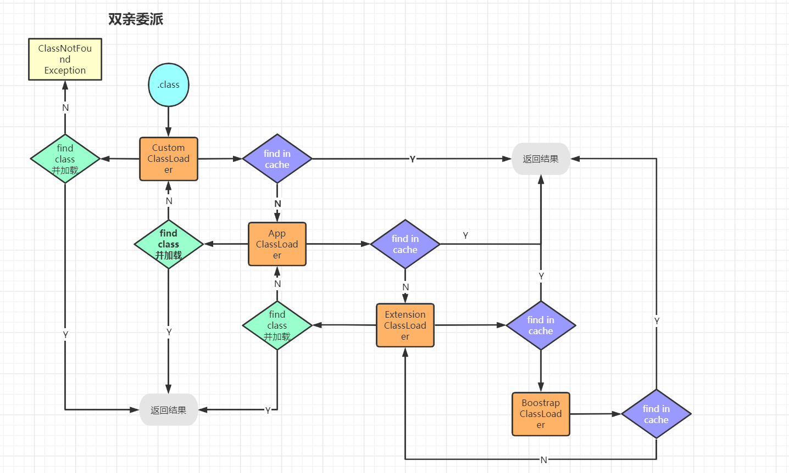

# JVM
> Jvm是一种规范，所有符合.class格式的文件都可以在JVM上运行。
>
## class文件(了解)
1. 二进制字节流
2. 数据类型：u1,u2,u4,u8和_info(表类型)
   class文件大概分为几个模块，比如说版本号（minor version/major version）,常量池数量（constan_pool_count），
   常量池（constant_pool 表结构）等等
- 观察byteCode的方法
    1. javap (java自带的工具)
    2. JBE
    3. JClassLib （idea插件）

### 常量池
类型：
1. CONSTANT_Utf8_info: tag->1(标记，代表常量类型)，length为UTF-8字符串占用的字节数，bytes为长度为length的UTF-8字符串
2. CONSTANT_Integer_info: tag->4

构造方法的方法名在常量池就是`init`,所以初始化时调用init方法也就是调用构造方法

## 基础知识

- 从编译到执行的路径如下图所示：
  

`.java`文件-(javac编译)->`.class` ->加载到内存-ClassLoader->

### java类的生命周期

一个java类是如何从.java文件，加载到内存再运行的，其生命周期如下图所示：

其中连接过程又分为：准备，验证与解析三个子过程

> 当一个class被load到内存中，会生成两个东西：
> 1. 二进制字符流的class文件被加载到内存上 
> 2. 一个class对象，该对象指向内存中加载的class文件

### 类加载过程：

loading->linking(verification->preparation->resolution)->initialization
> 注: Method Area(方法区)：
> 1.8之前放在 Permanent generation(永久代) 
> 1.8之后放在 MetaSpace(元数据区)

类加载的过程有三步：

1. 根据全类名获取定义该类的二进制字节流 .class
2. 将二进制字节流所定义的**静态存储结构**转换成方法区的**运行时数据结构**
3. 在内存中为该类的class对象开辟空间，该class对象即为该类方法区的入口地址。

> 一个非数组类的加载阶段（加载阶段获取类的二进制字节流的动作）是可控性最强的阶段，
> 这一步我们可以去完成还可以自定义类加载器去控制字节流的获取方式（重写一个类加载器的 loadClass() 方法）。数组类型不通过类加载器创建，它由 Java 虚拟机直接创建。

加载阶段和连接阶段的部分内容是交叉进行的，加载阶段尚未结束，连接阶段可能就已经开始了。

### 连接

- 验证（verification）：验证一共包括四步。
    1. 文件格式验证：
    2. 元数据验证：
    3. 字节码验证：
    4. 符号引用验证：
- 准备（preparation）：为类变量（静态变量）分配内存，设置初始值的过程。这些内存都在方法区中分配。一般来说，设置的初始值都是基本初始值，除非这个变量被`final`修饰。
    1. 这时候进行内存分配的仅包括类变量（static），而不包括实例变量，实例变量会在对象实例化时随着对象一块分配在 Java 堆中。
    2. 这里所设置的初始值"通常情况"下是数据类型默认的零值（如0、0L、null、false等），比如我们定义了public static int value=111 ，
       那么 value 变量在准备阶段的初始值就是 0 而不是111（初始化阶段才会赋值）。特殊情况：比如给 value 变量加上了 fianl 关键字public
       static final int value=111 ，那么准备阶段 value 的值就被赋值为 111。基本数据的初始值如下：
       
- 解析（resolution）：JVM将常量池内的**符号引用**替换为**直接引用**的过程,主要针对类或接口、字段、类方法、接口方法、方法类型、方法句柄和调用限定符7类符号引用进行

### 初始化
    
## 类加载器
类加载器分不同的层次，不同层次的类加载器负责加载不同的class。  

- 父加载器：不是类加载器的加载器，如上图所示，CustomClassLoader的父加载器是AppClassLoader,
  但是不是说CustomClassLoader是继承于AppClassLoader的，而是说当加载某个class找不到CustomClassLoader时，
  去委托给他的父加载器进行加载。
  
### 双亲委派
是一个孩子向父亲，然后父亲向孩子方向的双亲委派过程。

为什么要搞双亲委派的机制：不会重复操作吗
主要是为了安全，不让自定义的classloader来替代核心的类加载器。

