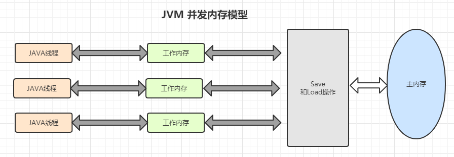

# 并发

## JUC

JUC:java.util.concurrent java自带的与并发相关的包，包括三部分  
- Atomic: 原子类所在的包
- lock： 锁
- 各种线程通信类

这边主要讲一下

## 分布式事务
1. 两阶段提交：使用事务管理器获取各个资源的状态，本地资源管理器一般使用数据库实现，当事务管理器从所有资源节点获取的回应都是yes的，
   则在第二阶段进行事务提交。如果有一个资源节点回复是no，则回滚事务。
    - 事务管理器向所有本地资源管理器发起请求，询问是否是 ready 状态，所有参与者都将本事务能否成功的信息反馈发给协调者；
    - 事务管理器根据所有本地资源管理器的反馈，通知所有本地资源管理器，步调一致地在所有分支上提交或者回滚。
   
2. 本地消息表 
3. 消息最终一致性 利用rocketMq 实现

## 分布式id
1. UUID
2. 雪花算法
## 分布式锁
1. redis实现分布式锁 `set lock val nx ex [time]` redis集群情况下实现分布式锁，redLock算法
