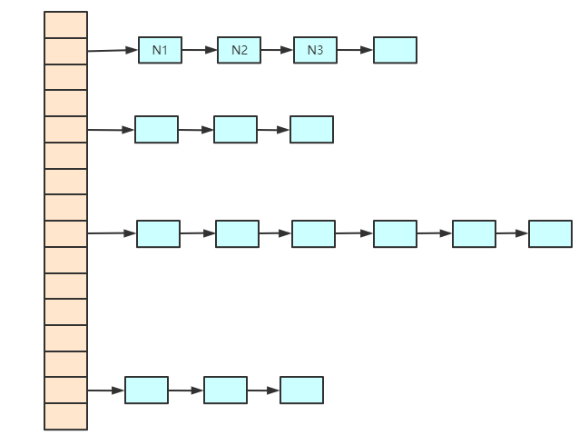

# Map

## HashMap (重点)

1.7及之前：数组+链表 (链表主要是为了解决hash冲突，使用`拉链法`)


jdk1.7及之前，HashMap添加元素的过程：
    1. 根据key的hashCode经过扰动函数（即hash函数）计算之后得到hash值
    2. 通过 `(n - 1) & hash` 来判断该元素该放入数组的哪个位置，n为数组长度
    3. 如果数组的该位置存在元素则
- hash函数：
```java
public class HashMap<K, V> extends AbstractMap<K, V> implements Map<K, V>, Cloneable, Serializable {
    static final int hash(Object key) {
        int h;
        return key == null ? 0 : (h = key.hashCode()) ^ h >>> 16;
    }
}
```

1.8及之后在原有的基础上加了`红黑树`。
- 红黑树转换的阈值：
    1. 链表长度超过8
    2. 数组长度超过64
    

