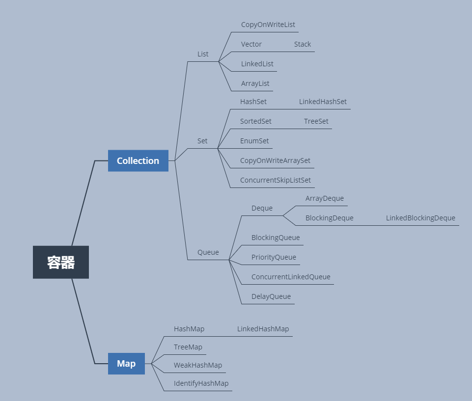
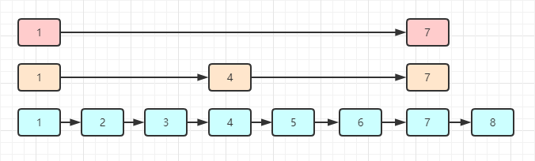

# 容器

容器主要分为两类：

1. Collection : 元素是单个存在
2. Map : 元素成对出现



- Vector -> HashTable
- CopyOnWriteList
- ConcurrentHashMap (重点)
- ConcurrentSkipListMap (跳表)

- BlockingQueue -> ThreadPool  多线程的环境下，容器多使用Queue

## List

List主要是两个容器类,这两个容器类都是线程不安全的。

1. ArrayList
2. LinkedList

两者的区别是底层实现的数据结构不一致，ArrayList使用的是数组；LinkedList使用的是链表。

### LinkedList

LinkedList的特点：

1. 由于底层是链表实现的，所以在头部、尾部插入与删除元素的时间复杂度为为O(1)。 但是，遍历的时间复杂度为O(N)，同时随机插入与删除的方法都需要先遍历找到元素在进行操作，所以时间复杂度也为O(N)。
2. 另外，LinkedList实现许多List没有的方法，比如说在头部与尾部进行元素的操作，通过这些操作，我们很容易基于LinkedList来构建栈与队列。

源码学习我们主要看一下几个方法：

- 内部节点类的实现： 一个item作为节点存储数据的属性，另外就是一个前驱节点和一个后置节点的引用。 构造参数通过传入前驱节点及后置节点来使新节点接入链表中。
  ```java
        private static class Node<E> {
        E item;
        LinkedList.Node<E> next;
        LinkedList.Node<E> prev;

        Node(LinkedList.Node<E> prev, E element, LinkedList.Node<E> next) {
            this.item = element;
            this.next = next;
            this.prev = prev;
        }
    }
  ```
- 放入与拿出的方法：  
  由于LinkedList底层是双向链表，所以可以在头部、尾部放入与拿出。
    ```java
    public class LinkedList<E> extends AbstractSequentialList<E> implements List<E>, Deque<E>, Cloneable, Serializable {
        // size被transient修饰，即不会被序列化
        transient int size;
        // 头部引用
        transient LinkedList.Node<E> first;
        // 尾部引用
        transient LinkedList.Node<E> last;
        private static final long serialVersionUID = 876323262645176354L;
        
        private void linkFirst(E e) { 
            LinkedList.Node<E> f = this.first;
            LinkedList.Node<E> newNode = new LinkedList.Node((LinkedList.Node)null, e, f);
            this.first = newNode;
            if (f == null) {
                this.last = newNode;
            } else {
                f.prev = newNode;
            }
    
            ++this.size;
            ++this.modCount;
        }
        
         private E unlinkFirst(LinkedList.Node<E> f) {
            E element = f.item;
            LinkedList.Node<E> next = f.next;
            f.item = null;
            f.next = null;
            this.first = next;
            if (next == null) {
                this.last = null;
            } else {
                next.prev = null;
            }
    
            --this.size;
            ++this.modCount;
            return element;
        }
    }
    ```

  放入的方法有很多，比如说在头部放入，在尾部放入。大体过程相同，都是new一个节点类，只不过操作不同的节点引用。头部插入就操
  作first引用、尾部 插入就操作last引用, 最后修改size与modCount，LinkedList的大多数方法都是这样类似的。 其实只要读懂了
  linkFirst与unLinkFirst两个方法，其他的方法都差不多。至于addFirst与remove方法都是把这两类方法进行了封装。


### ArrayList
ArrayList底层是基于对象数组实现的，与LinkedList相比，在随机访问方便更优，可以根据下标直接定位到数组的元素。至于删除与增加就看操作的位置了。
如果在数组的结尾，那么增加和删除操作的时间复杂度为O(1)，但是操作如果在中间m处，需要把原先m及以后的元素的下标都往后移动，其时间复杂度为O(N-m).
当m=0，也就是在开头位置的时候，时间复杂度会上升到O(N)。  
ArrayList的还需要注意的地方就是关于扩容与缩容的问题，由于底层是对象数组，而数组这一数据结构在内存中是地址连续且容量固定的。那么当我们数组内的元素
加到数组容量的最大值时，在往里面增加元素就会造成数组越界的问题。
ArrayList类大概是平常遇到最多的Collection容器类了，所以这个类我们仔细研究一下。
  ```java
  
  public class ArrayList<E> extends AbstractList<E> implements List<E>, RandomAccess, Cloneable, Serializable {
      private static final long serialVersionUID = 8683452581122892189L;
      private static final int DEFAULT_CAPACITY = 10;
      private static final Object[] EMPTY_ELEMENTDATA = new Object[0];
      private static final Object[] DEFAULTCAPACITY_EMPTY_ELEMENTDATA = new Object[0];
      transient Object[] elementData;
      private int size;
      private static final int MAX_ARRAY_SIZE = 2147483639;
  
      public ArrayList(int initialCapacity) {
          if (initialCapacity > 0) {
              this.elementData = new Object[initialCapacity];
          } else {
              if (initialCapacity != 0) {
                  throw new IllegalArgumentException("Illegal Capacity: " + initialCapacity);
              }
  
              this.elementData = EMPTY_ELEMENTDATA;
          }
  
      }
  
      public ArrayList() {
          this.elementData = DEFAULTCAPACITY_EMPTY_ELEMENTDATA;
      }
      
    }
  ```

先看几个属性：
- private static final Object[] EMPTY_ELEMENTDATA = new Object[0]; ： 空元素的数组
- private static final Object[] DEFAULTCAPACITY_EMPTY_ELEMENTDATA = new Object[0]; ： 看名字，默认容量的空数组

我们先看这两个属性，修饰他们的关键字 static,final。意味着这两个类是静态变量（类所有）与不可更改其引用。先问两个问题：
1. 为什么用static+final来修饰这两个属性？
   static意味着所有ArrayList对象共享同一个内存片段，不必每次new对象的时候额外开辟内存空间。另外final保证所有对象不会篡改该引用的指向，即这两个属性始终指向有0个元素的Object数组。
2. 这两个属性都是空数组的，两个属性的区别在哪，或者说两个属性分别用在了哪些不同的地方？
   EMPTY_ELEMENTDATA在有人为设定初始化容量的方法中使用，即如果我指定了初始化容量initCapacity，在初始化ArrayList对象的时候，如果initCapacity=0，那么我会将新对象指向EMPTY_ELEMENTDATA  
   如果我没有指定初始化容量，那么我就会将新对象的引用指向DEFAULTCAPACITY_EMPTY_ELEMENTDATA来完成初始化。 至于为什么同为空元素数组却要区分开，暂时还没搞明白。

-  transient Object[] elementData; ：这个是存放ArrayList元素的数组，使用transient来修饰，指定不序列化。


再看几个方法：
- 扩容：ensureCapacity -> grow -> newCapacity -> hugeCapacity
  ```java
  public class ArrayList<E> extends AbstractList<E> implements List<E>, RandomAccess, Cloneable, Serializable {
    public void ensureCapacity(int minCapacity) {
      if (minCapacity > this.elementData.length && (this.elementData != DEFAULTCAPACITY_EMPTY_ELEMENTDATA || minCapacity > 10)) {
          ++this.modCount;
          this.grow(minCapacity);
      }
    }

    private Object[] grow(int minCapacity) {
        return this.elementData = Arrays.copyOf(this.elementData, this.newCapacity(minCapacity));
    }

    private Object[] grow() {
        return this.grow(this.size + 1);
    }

    private int newCapacity(int minCapacity) {
        int oldCapacity = this.elementData.length;
        int newCapacity = oldCapacity + (oldCapacity >> 1);
        if (newCapacity - minCapacity <= 0) {
            if (this.elementData == DEFAULTCAPACITY_EMPTY_ELEMENTDATA) {
                return Math.max(10, minCapacity);
            } else if (minCapacity < 0) {
                throw new OutOfMemoryError();
            } else {
                return minCapacity;
            }
        } else {
            return newCapacity - 2147483639 <= 0 ? newCapacity : hugeCapacity(minCapacity);
        }
    }

    private static int hugeCapacity(int minCapacity) {
        if (minCapacity < 0) {
            throw new OutOfMemoryError();
        } else {
            return minCapacity > 2147483639 ? 2147483647 : 2147483639;
        }
    }
  }
  ```
  看几个方法：
    1. private int newCapacity(int minCapacity): 这个方法写了扩容时新数组容量为多少的主要逻辑，大概有几个需要注意的地方，
        1. 新数组的默认容量为原数组的1.5倍，` int newCapacity = oldCapacity + (oldCapacity >> 1);`
        2. 如果默认容量比参数minCapacity的值要小，即扩容为1.5倍之后无法满足需求，那么会进行一些判断，看一下新数组的容量到底为多少。
        3. 如果新数组容量newCapacity大于给定的minCapacity, 

## Map
Map接口一般可以分为两类：  
1. 无序的HashMap
2. 有序的TreeMap

另外如果是在高并发环境下，对应的分别是：  
1. 无序的ConcurrentHashMap
2. 有序的ConcurrentSkipListMap(跳表)  

之所以没有ConcurrentTreeMap是因为TreeMap底层是红黑树实现的，而ConcurrentMap为保证线程安全使用的是CAS操作
基于树结构来实现CAS操作的复杂度比较高，所以这里使用了跳表。跳表结构如下:  
  
在底层链表中，如果数据量比较多，那么可以根据不同步长选取若干节点，来组成第二层链表；如果第二层链表数据量依然比较多，那么可以继续形成
第三层链表。遍历时从顶层链表开始遍历，比如我们如果想找上图的`5`节点，那么遍历顶层链表发现`5`位于`1`和`7`之间，那么就去下一层链表。
下一层链表遍历发现`5`位于`4`和`7`之间，那么再去下一层链表遍历得到`5`

## CopyOnWrite (写时复制)
   写时复制：操作系统中允许父子进程最初共享相同页进行工作，在某一进程进行写操作时，会把共享页复制一份，使进行写操作的进程在新的页进行。
这里的写时复制与OS的思想相似。当读线程访问的时候，共享同一块内存；当写线程操作的时候，复制原内存的内容，然后在新的内存区域追加新元素之后，
然后将原引用指向新的内存区域。  
  写时复制的List对于读线程多，写线程少的程序比较友好，因为读操作不需要加锁，只有写线程进行加锁。我们可以看看源码
```java
public class CopyOnWriteArrayList<E> implements List<E>, RandomAccess, Cloneable, Serializable {
    private static final long serialVersionUID = 8673264195747942595L;
    final transient Object lock = new Object();
    private transient volatile Object[] array;

    public E get(int index) {
        return elementAt(this.getArray(), index);
    }

    public E set(int index, E element) {
        synchronized(this.lock) {
            Object[] es = this.getArray();
            E oldValue = elementAt(es, index);
            if (oldValue != element) {
                es = (Object[])es.clone();
                es[index] = element;
            }

            this.setArray(es);
            return oldValue;
        }
    }

    public boolean add(E e) {
        synchronized(this.lock) {
            Object[] es = this.getArray();
            int len = es.length;
            es = Arrays.copyOf(es, len + 1);
            es[len] = e;
            this.setArray(es);
            return true;
        }
    }
    
}
```
- ` public E get(int index)`:这个方法很简单，就是返回下标对应的元素。
- `public E set(int index, E element)`:这个方法体内加了锁，逻辑如下，
    1. 复制原数组
    2. 获取需设置的下标对应的元素
    3. 查看要设置的元素与原元素是否相同，不相同则在新数组中将其更改
    4. 修改数组引用，使其指向新的数组
    5. 返回被设置的原数组的元素
    
- `public boolean add(E e)`: 这个方法也加了锁，逻辑如下，
    1. 复制原数组，得到新数组es
    2. 把原数组元素+1后的数组复制给es
    3. 令结尾元素等于新添加的元素
    4. 修改数组引用，使其指向新的数组
    5. 返回结果

   