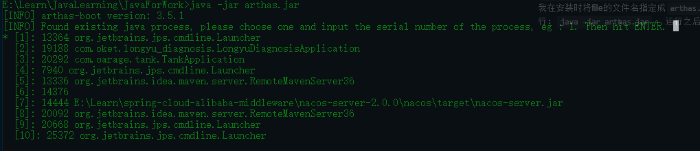
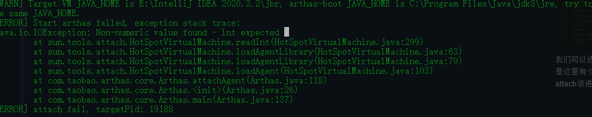
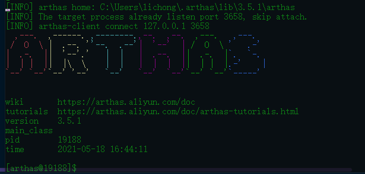
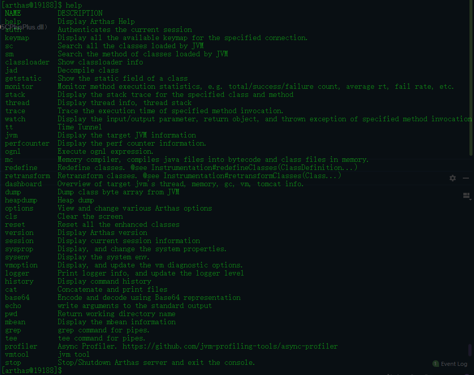
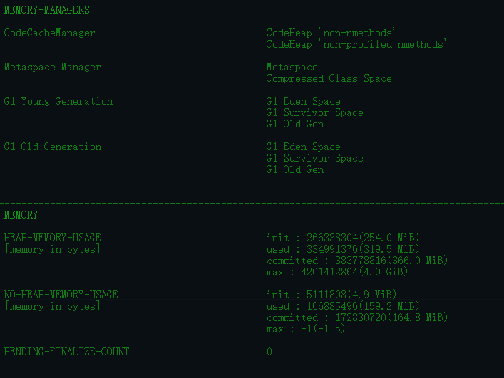
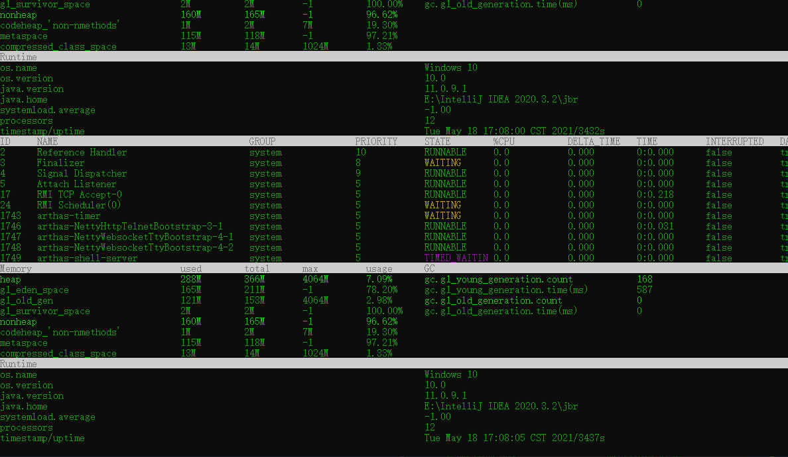
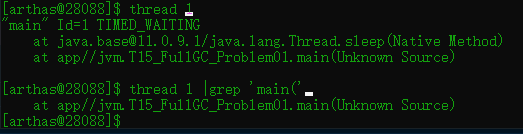
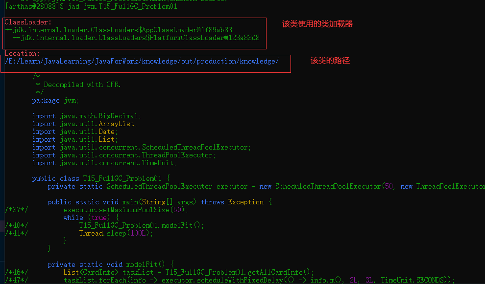

# Arthas

Arthas是阿里开源的java诊断工具，相比于jdk自带的java诊断工具更加方便，功能也更加强大。  
git地址：[https://github.com/alibaba/arthas](https://github.com/alibaba/arthas)  
文档地址: [https://arthas.aliyun.com/en-us/](https://arthas.aliyun.com/en-us/)  
Arthas可以为我们解决很多问题： 如HTTP请求的qps, rt, 错误数, 线程池信息等等。

1. 查看运行时jvm的参数，包括内存和GC情况
2. 对class文件进行反编译，当我们在生产环境下，想要查看我们部署的代码是否是最新版的，快速确定代码问题时可以对class文件进行反编译来查看
3. 对运行时的类进行热替换，当我们想要在生产环境下对某段代码进行debug，可以直接编辑好类的log语句，然后通过热替换，将新的类加载到内存来 替换原来类。
4. 快速定位应用热点，生产火焰图

## 安装

安装部分，官方文档推荐用`arthas-boot.jar`,可以通过curl来在线安装`arthas`,安装命令如下：  
`curl -0 https://arthas.aliyun.com/arthas-boot.jar --output <file>`  
我在安装时将file的文件名指定成`arthas.jar`，然后直接将该文件作为jar文件进行运行：`java -jar arthas.jar`。 运行之后，它会自动扫描你正在运行的java应用进程：

我们可以选择一个我们正在进行的进程，看一下。直接选择编号，然后enter即可。但是这里有个小坑，如果你在该页面停留太久了，然后选择要诊断的进程编号可能会报以下错误

这个我们可以重新启动一下arthas，然后选择即可。选择之后会进入arthas的命令界面：

如果我们第一次使用，不知道有哪些命令，可以使用`help`命令来帮助我们查看`arthas`的命令：

着重介绍几个比较常用的命令：

- jvm： 可以查看jvm的基本参数，版本、启动参数等
  
  这个命令也可以查看jvm的内存情况：我使用的是jdk11，所以默认的垃圾回收器是`G1`，jdk8的默认垃圾回收器是`Parallel Scavenge + Parallel Old`。 我们可以看到内存使用的大概情况。
  

- dashboard : 可以看到实时的CPU和内存的使用情况，这个是实时刷新的，如果运行在Ali-tomcat上，可以展示tomcat的信息，比如说HTTP请求的qps, rt, 错误数, 线程池信息等等。 使用`ctrl+C`退出
  
  注： 这里CPU的使用情况时按照线程展示的，你可以看到哪个线程占用的CPU最多

- thread :这个命令可以配合`dashboard`来使用，比如我们通过`dashboard`找到了最消耗CPU的线程，那么我们可以查看该线程都调用了那些方法
  `thread <thread-id>`,还可以配合`通道`使用，来缩小查找的范围`thread <thread-id> | grep 'MethodNmae'`
  

- jad ：这个命令我觉得很厉害，可以对代码进行反编译，当我们部署新版本之后，新的功能没有生效时，可以使用该命令来查看部署的版本是否正确
  

- redefine : 在不停止服务的情况下，对服务内的类进行热替换，这里有一些限制，不能修改方法名和属性，这个方法我觉得更重要的还是在线上调试时使用。 我们可以在对线上的程序通过增加log语句，探针等方式诊断线上环境的运行情况。
  官方文档给出了一些`redefine`的注意事项，并推荐使用`retransform`

    1. redefine的class不能修改、添加、删除类的field和method，包括方法参数、方法名称及返回值
    2. 如果mc失败，可以在本地开发环境编译好class文件，上传到目标系统，使用redefine热加载class
    3. 目前redefine 和watch/trace/jad/tt等命令冲突，以后重新实现redefine功能会解决此问题

  注意， redefine后的原来的类不能恢复，redefine有可能失败（比如增加了新的field），参考jdk本身的文档。

  > reset命令对redefine的类无效。如果想重置，需要redefine原始的字节码。
   
  >redefine命令和jad/watch/trace/monitor/tt等命令会冲突。执行完redefine之后，如果再执行上面提到的命令，则会把redefine的字节码重置。
  原因是jdk本身redefine和Retransform是不同的机制，同时使用两种机制来更新字节码，只有最后修改的会生效。
  

 

  
