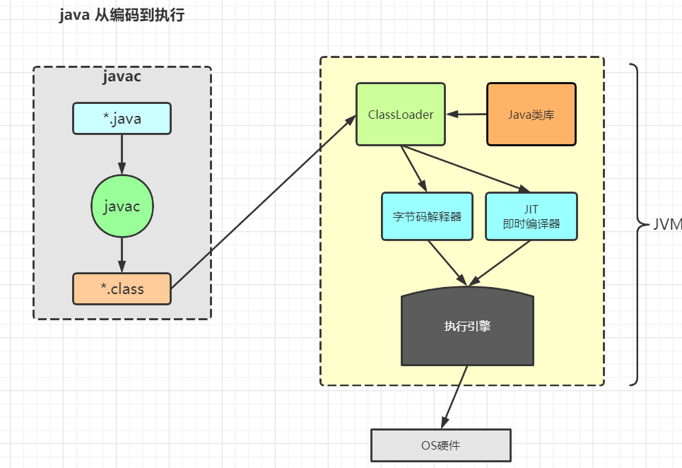
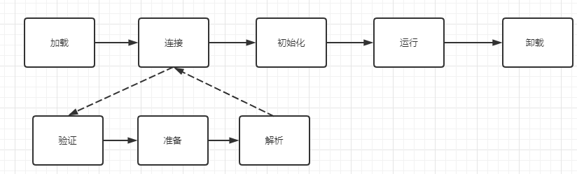
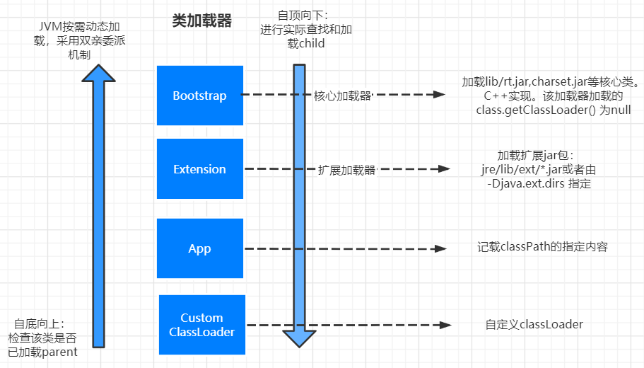
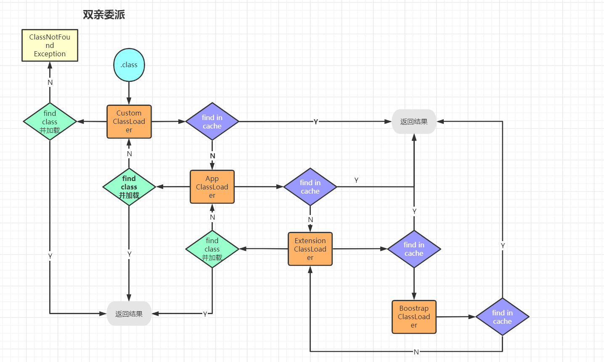
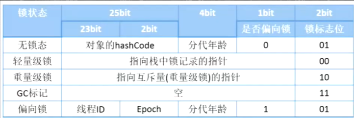
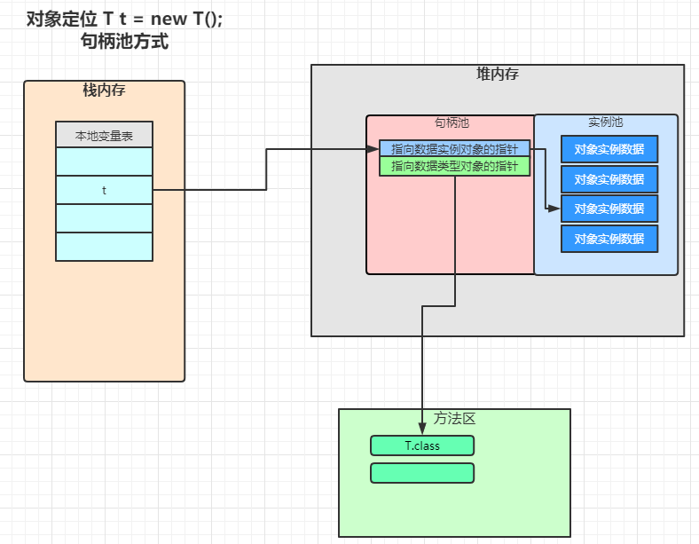
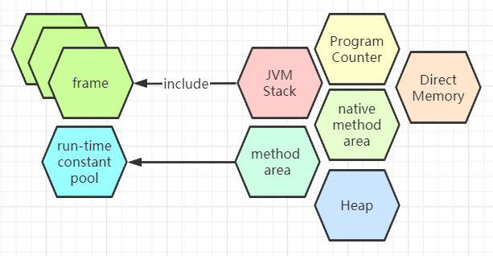
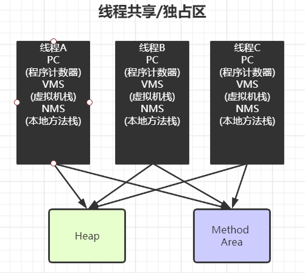
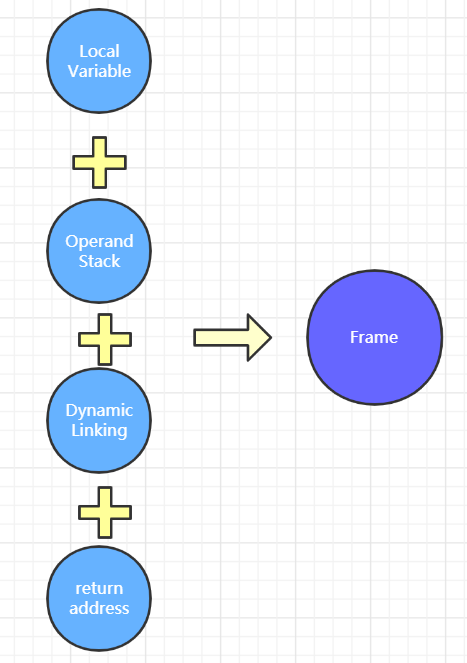

# JVM

> Jvm是一种规范，所有符合.class格式的文件都可以在JVM上运行。
>

## class文件(了解)

1. 二进制字节流
2. 数据类型：u1,u2,u4,u8和_info(表类型)
   class文件大概分为几个模块，比如说版本号（minor version/major version）,常量池数量（constan_pool_count）， 常量池（constant_pool 表结构）等等

- 观察byteCode的方法
    1. javap (java自带的工具)
    2. JBE
    3. JClassLib （idea插件）

### 常量池

类型：

1. CONSTANT_Utf8_info: tag->1(标记，代表常量类型)，length为UTF-8字符串占用的字节数，bytes为长度为length的UTF-8字符串
2. CONSTANT_Integer_info: tag->4

构造方法的方法名在常量池就是`init`,所以初始化时调用init方法也就是调用构造方法

## 基础知识

- 从编译到执行的路径如下图所示：
  

`.java`文件-(javac编译)->`.class` ->加载到内存-ClassLoader->

### java类的生命周期

一个java类是如何从.java文件，加载到内存再运行的，其生命周期如下图所示：

其中连接过程又分为：准备，验证与解析三个子过程

> 当一个class被load到内存中，会生成两个东西：
> 1. 二进制字符流的class文件被加载到内存上
> 2. 一个class对象，该对象指向内存中加载的class文件

### 类加载过程：

loading->linking(verification->preparation->resolution)->initialization
> 注: Method Area(方法区)：
> 1.8之前放在 Permanent generation(永久代)
> 1.8之后放在 MetaSpace(元数据区)

类加载的过程有三步：

1. 根据全类名获取定义该类的二进制字节流 .class
2. 将二进制字节流所定义的**静态存储结构**转换成方法区的**运行时数据结构**
3. 在内存中为该类的class对象开辟空间，该class对象即为该类方法区的入口地址。

> 一个非数组类的加载阶段（加载阶段获取类的二进制字节流的动作）是可控性最强的阶段，
> 这一步我们可以去完成还可以自定义类加载器去控制字节流的获取方式（重写一个类加载器的 loadClass() 方法）。数组类型不通过类加载器创建，它由 Java 虚拟机直接创建。

加载阶段和连接阶段的部分内容是交叉进行的，加载阶段尚未结束，连接阶段可能就已经开始了。

### 连接

- 验证（verification）：验证一共包括四步。
    1. 文件格式验证： 验证加载的文件符不符合class文件的规范，比如说文件开头是不是以`cafe babe`开头，版本位`minor version`/`major version`在不在JVM的处理范围内等
    2. 元数据验证： 对字节码文件描述的语义信息进行检查，如: 该类是不是有父类（除Object之外的类都有父类），是否继承了不能继承的类(父类是否被final修饰)等
    3. 字节码验证： 比较复杂
    4. 符号引用验证： 使用*直接引用*替换*符号引用*
- 准备（preparation）：为类变量（静态变量）分配内存，设置初始值的过程。这些内存都在方法区中分配。一般来说，设置的初始值都是基本初始值，除非这个变量被`final`修饰。
    1. 这时候进行内存分配的仅包括类变量（static），而不包括实例变量，实例变量会在对象实例化时随着对象一块分配在 Java 堆中。
    2. 这里所设置的初始值"通常情况"下是数据类型默认的零值（如0、0L、null、false等），比如我们定义了public static int value=111 ， 那么 value 变量在准备阶段的初始值就是 0
       而不是111（初始化阶段才会赋值）。特殊情况：比如给 value 变量加上了 fianl 关键字public static final int value=111 ，那么准备阶段 value 的值就被赋值为
       111。基本数据的初始值如下：
       
- 解析（resolution）：JVM将常量池内的**符号引用**替换为**直接引用**的过程,主要针对类或接口、字段、类方法、接口方法、方法类型、方法句柄和调用限定符7类符号引用进行

### 初始化

调用`<clinit>`方法，赋予初始值，所以如果对象的属性没有被赋初始值，那值就是在连接->准备过程中所给予的默认值。

- 注意，这里的`<clinit>`方法并非构造方法，因为这个是将类加载到内存的过程，而非生成实例的过程，这个init方法应该是为类的静态变量赋予初始值。
- new Object(); new对象的过程也分为两步：1. 为成员变量分配内存空间，赋默认值 2. 调用构造方法赋初始值

### 卸载

分清楚类的GC与对象的GC。

- 类的GC：内存代表这个类的class对象被回收，这个class对象是方法区中该类（class文件？）的入口。 类GC即该类的class对象被回收，一般来说，我们定义的类有可能被GC，jvm自带的类不会被GC。 类被GC是有前提条件的：
    1. 该类的所有对象实例都被GC
    2. 没有其他指向该类的引用

## 类加载器 ClassLoader

类加载器分不同的层次，不同层次的类加载器负责加载不同的class。  


- 父加载器：不是类加载器的加载器，如上图所示，CustomClassLoader的父加载器是AppClassLoader,
  但是不是说CustomClassLoader是继承于AppClassLoader的，而是说当加载某个class找不到CustomClassLoader时， 去委托给他的父加载器进行加载。
- loadClass: 在硬盘中获取类的源码，将其转为字节码加载到内存中，然后返回一个class对象。`XXX.class.getClassLoader().loadClass("class_full_name")`。 使用途径：
    1. spring动态代理，将一个新Class加载到内存中
    2. 热部署时，也会用loadClass来将类加载到内存中

```java
public abstract class ClassLoader {
    /**
     * loadClass 源码解析
     * @param name
     * @param resolve
     * @return
     * @throws ClassNotFoundException
     */
    protected Class<?> loadClass(String name, boolean resolve) throws ClassNotFoundException {
        // 这个需要保证线程安全
        synchronized (this.getClassLoadingLock(name)) {
            //TODO 第一步，检查该类是否被加载过了，如果被加载过了（cache里面有该类的class对象），直接返回
            Class<?> c = this.findLoadedClass(name);
            if (c == null) {
                // 如果没有被加载过，执行下列逻辑
                long t0 = System.nanoTime();

                try {
                    // 委派给父加载器去加载  双亲委派 子加载器向上委托父类进行查询
                    if (this.parent != null) {
                        //父加载器同样调用loadClass这个方法，也会走上面的流程，
                        c = this.parent.loadClass(name, false);
                    } else {
                        // 到了Bootstrap这个顶级加载器之后，就会查找bootstrap对应的缓存内有无加载过该类
                        c = this.findBootstrapClassOrNull(name);
                    }
                } catch (ClassNotFoundException var10) {
                }
                //TODO 第二步,如果没有在缓存中找到这个类，那就去加载这个类，这里第二次判断为空时因为父加载器可能已经加载了对应的类，
                if (c == null) {
                    long t1 = System.nanoTime();
                    //protected findClass 该方法: throw new ClassNotFoundException(name); 需要子类去实现一下该方法，这个方法也是我们自定义类加载器的关键
                    c = this.findClass(name);
                    PerfCounter.getParentDelegationTime().addTime(t1 - t0);
                    PerfCounter.getFindClassTime().addElapsedTimeFrom(t1);
                    PerfCounter.getFindClasses().increment();
                }
            }

            if (resolve) {
                this.resolveClass(c);
            }

            return c;
        }
    }
}
```

### 定义ClassLoader

继承`ClassLoader`,重写`findClass`方法即可。案例见[自定义ClassLoader](JVM_03_ClassLoader.java)

### 双亲委派

是一个孩子向父亲，然后父亲向孩子方向的双亲委派过程。

为什么要搞双亲委派的机制：不会重复操作吗 主要是为了安全，不让自定义的classloader来替代核心的类加载器。

## 混合模式

- 解释器：bytecode interpreter
- 编译器：Just In-Time compiler
- 混合模式：
    1. 混合使用解释器+热点代码编译
    2. 起始阶段采用解释执行，
    3. 热点代码检测：

    - 多次被调用的方法 （方法计数器，监测方法执行的频率）
    - 多次被调用的循环 （循环计数器，监测循环执行的频率）
    - 进行编译

注：

- -Xmixed 默认混合模式，开始解释执行，启动速度较快，对热点代码进行检测和编译
- -Xint 使用解释模式，启动很快，执行稍慢
- -Xcomp 使用纯编译模式，执行很快，启动较慢

## 懒加载 lazyInitializing （了解）

没有规定合适加载，但是规定了必须初始化的条件：

1. new,getstatic,putstatic,invokestatic指令，访问final变量除外
2. java.lang.reflect对类进行反射调用时
3. 初始化子类，必先初始化父类
4. 虚拟机启动时，被执行的主类必须初始化
5. 动态语言支持java.lang.invoke.MethodHandle解析结果为REF_getstatic,REF_putstatic,REF_invokestatic的方法句柄时，该类必须初始化

老的CPU： 总线锁，在L3缓存到L2(CPU内部)之间有个总线，每次有CPU的线程去读L3的数据时，给整个总线上锁。 新的CPU： MESI Cache 各种缓存一致性协议

### 缓存行 CacheLine

读取缓存时，以CacheLine为基本单位

- 伪共享： 位于同一缓存行的不同数据被不同CPU锁定，产生互相影响的伪共享问题

### 硬件层数据一致性

## 乱序问题

CPU为了提高指令执行效率，会在执行一条指令的期间（比如说去内存读数据（时间较长）），去执行另一条指令，前提是 两条指令之间没有依赖关系。

### CPU内存屏障

以Inter的内存屏障为例：

- `sfence`: 在`sfence`前的写指令必须在`sfence`后的写指令之前完成
- `wfence`: 在`wfence`前的读指令必须在`wfence`后的读指令之前完成
- `mfence`: 在`mfence`前的读写指令必须在`mfence`后的读写指令之前完成

### JVM内存屏障

- LoadLoadBarrier
- LoadStoreBarrier
- StoreStoreBarrier
- StoreLoadBarrier

## volatile

实现细节：

- 字节码层面： 0x0040 [ACC_VOLATILE]
- JVM层面： volatile内存区的读写都加内存屏障
    - StoreStoreBarrier  [Volatile 写操作]   StoreLoadBarrier
    - LoadLoadBarrier [Volatile 读操作]  LoadStoreBarrier

## synchronized

字节码层面：

- synchronized方法：在`access_flag` 修饰符上注明是`ACC_SYNCHRONIZED`的
- synchronized代码块： 一个`monitorenter`和两个`monitorexit`,在`monitorenter`与`monitorexit`中间的指令是加锁的，只允许一个现场进行访问。
  之所以有两个`monitorexit`是为了在`synchronized`代码块内的语句出现异常时退出用的。

JVM层面：

- C/C++调用操作系统提供的同步机制

## 对象的内存布局

> 观察虚拟机配置：`java +XX:PrintCommandLineFlags -version`

### 对象创建过程

1. class loading
2. class linking(verification,preparation,resolution)
3. class initializing：静态变量赋初始值，调用静态语句块
4. 申请对象内存
5. 成员变量赋默认值
6. 调用构造方法<init>: 1.成员变量顺序赋初始值 2.调用构造方法

### 对象在内存中的布局如何

- 普通对象: new Object 对象 16个
    1. 对象头：markdown 8
    2. ClassPointer指针：指向class对象 -XX:+UseCompressedClassPointers 使用压缩的Class指针（4字节），不开启是8字节。默认开启
    3. 实例数据：引用类型,
    4. padding对齐： 8的倍数
- 数组对象：
    1. 对象头：markdown 8
    2. ClassPointer指针：数组元素的class对象
    3. 数组长度： 4字节
    4. 数组数据
    5. padding对齐：8的倍数

> ClassPointer:类对象指针，指向内存中的class对象 压缩参数 -XX:+UserCompressedClassPointers  
> oops:Ordinary object pointers 普通对象指针，类的引用类型的成员变量的指针 压缩参数： -XX:UserCompressedOops

### 对象头包括什么

    - markword: 锁定信息，GC标记（分代年龄）
      
      查看对象头的内容应该看该对象目前处在一个什么样的锁状态：
      - 无锁态： 0-24位是对象的hashCode |  24-28位是分代年龄
      - 轻量级锁：
      - 重量级锁：
      - GC标记状态
      - 偏向锁：
    1. hashCode:
    31位的hashCode ->System.identifyHashCode()
    2. 为什么GC年龄最大是15？对象头中4位表示GC的年龄，因此能表示的最大正整数是15，也就是GC最大的年龄是15.

4. 对象如何定位
5. 对象如何分配
6. Object o = new Object在内存中占多少个字节

### 对象如何定位

1. 句柄池：GC时的效率较高
   
2. 直接指针（HotSpot实现方式）:定位的效率相对较高

### 对象如何分配


### Object o = new Object在内存中占多少个字节


## 运行时数据区 (Run-Time Data Area)



- PC(Program Counter,程序计数器)： 存放下一条指令
  1. 每个JVM的线拥有其自己的栈帧 （线程独有）
- JVM Stack: 每个线程一个栈，每个方法一个栈帧（线程独有）
    Frames（栈帧）:
    1. Local Variable Table
    2. Operand Stack
    3. Dynamic Linking
- Heap:堆与GC相关，线程共享
- native method area: 本地方法区，存放C/C++写的方法
- Direct Memory：直接内存，从java内部直接访问OS管理的内存，用于IO操作。以网络IO为例，
  之前网络IO传过来的数据放到OS内存的一块区域，JVM想用的话需要将该区域的数据copy到JVM管理的内存，
  比较麻烦，现在的话直接操作OS的内存。NIO使用的就是直接内存，实现`zero copy`
  
- Method Area(方法区)：方法区是一个逻辑上的概念，用来存储class的结构。可以有不同的实现
  1. Perm Space(永久区，jdk1.8之前，不包括1.8)：字符串常量位于Perm Space,FGC（full gc）不会清理该区域
  2. Meta Space(元数据区，1.8及以后)：字符串常量位于堆，会触发FGC
  方法区包括`run-time constant pool`,运行时常量池，即class文件中的常量池部分，在运行时就放置在该区域
     
线程的独占与共享区域图解如下：


### 栈帧Frame

- Dynamic Linking: 每个栈帧中包含一个`Dynamic Linking`，指向常量池中的`符号链接`，查看该符号连接是否有解析等。
- Local Variable: 局部变量
- Operand Stack:  每个操作都会存在变量的`压栈`，`出栈`. 通过 操作栈可以使方法内部的操作递归的进行。
- return address: 方法返回时的地址

每个方法对应一个栈帧，每个栈帧中都包含上述四个部分

