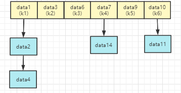
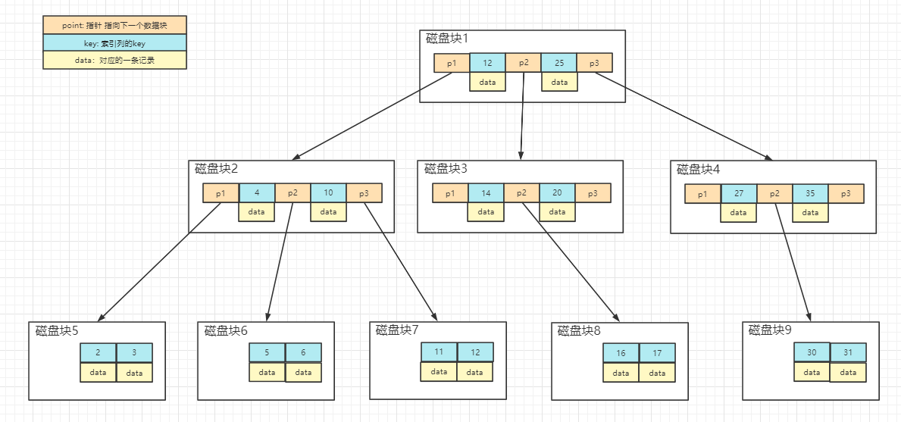

# 索引

## 索引底层实现

### HashTable
  

hashtable对等值查询比较友好，但是对于范围查询，需要对每个元素进行重遍历来定位，而在生产中范围查询出现的频率又是比较多的。
当然啦，对于大部分存储引擎来说，不支持HashTable格式的索引，目前只有Memory支持HashTable索引。

### B+树 
InnoDB和MYISAM索引底层实现的数据结构都是B+树，为什么要选择B+树，我们可以通过对比其他数据类型来得到答案。
- 二叉搜索、二叉平衡树、红黑树

 1. 二叉搜索在插入数据时可能会造成数据倾斜问题，在最坏情况下甚至可能会退化成链表结构。
 2. 二叉平衡树会通过旋转来调整树的结构，但是问题是这种旋转带来的开销比较大，如果大量的插入或者删除造成频繁的旋转，那么总体而已， 插入或者删除时的效率难以接收。二叉平衡树对查找会比较友好，查找的时间复杂度为O(logn)。
 3. 红黑树，通过增加颜色来降低旋转的次数，红黑树可以接受最大树深在最小树深两倍的范围内。

这三种树有个通用的问题，即孩子节点只有两个，即树深度会随着数据量的增加而增加，虽然每一层所能包含的数据量都是上一层的两倍， 但是树的高度依旧会比较大，这样在遍历时的代价可能就会很高。

- B树 
  谈B+树之前我们可以先了解一下B树，看一下B树相对于二叉树有什么优势，而又有那些问题所以让存储引擎最终选择了B+树
 
  1. 相比于二叉树，B树可以有多个孩子节点，且每个孩子节点是一个特殊的数组，或者叫做由多个数据节点做成的超级节点。
  每个非叶子节点都包含三类数据：    1. 指针数据，指向某个磁盘块 2. key，这个是索引列的值，B树/B+树是根据索引来构建的。 3. 数据，对应记录的值。
  2. B树的叶子节点存放的都是数据，没有指针。当定位到叶子节点的时候，要么找到数据返回，要么数据不存在找不到。   

  

  实例图说明：  
  每个节点占用一个磁盘块，每个磁盘块上包括三个指针和两个升序排列的关键字。指针存储的是子节点所在的磁盘块的地址，两个关键词划分三个范围。
  范围域对应三个指针。以根节点为例，两个关键字12，25可以划分为`小于12`,`大于12且小于25`以及`大于25`。  
  查找关键字12的过程如下：  
  1. 通过根节点找到磁盘块1，读入内存（第一次磁盘IO操作）
  2. 比较关键字12与13的关系，得到12可能在磁盘块2上,对应p1指针。
  3. 通过磁盘块的p1找到磁盘块2，读入内存 （第二次磁盘IO操作）
  4. 比较关键字与4，10的关系，得到数据可能在磁盘块7上，对应p3指针。
  5. 根据p3得到磁盘块7,读入内存 （第三次磁盘操作）
  6. 从磁盘块7中找到关键字12,获取到对应的记录。
  
  缺点：这边有个关键性的问题，由于B树的非叶子节点上存储内容包括数据，由于OS有个机制叫做磁盘预读，可能为了读某条数据而把整个磁盘块的数据都读到内存中。
  磁盘预读是每次读取页的整数倍，比如每次读16K，每一页是4k，即读4页的内容。 另外的话，由于操作系统的页和物理内存的物理磁盘块一般是一一对应的，每次IO会将预读的四个物理块上内容读取到内存中。
  ,如果极端情况下，指针不占用存储空间，且一条记录（key+data）占用空间是1K，即 每次磁盘预读对应的页上只包含`16`条数据，那么如果我们通过3次磁盘IO所能获取到的数据条数应该是多少呢。
  第一次磁盘IO，我们可以得到16条记录以及对应的16个指针域。 下一次磁盘IO基于16个指针域我们又可以获得`16*16=256`条记录。第三次磁盘IO我们可以选择的数据条数则成了`256*16=4096`条记录。
  所以可以遍历的条数比较少，而造成这种问题的原因就在于非叶子节点存储了data数据内容。
  
- B+树
  B+树相比于B-树做出的优化，将非叶子节点内的数据去掉，每个非叶子节点只保存索引列对应的key以及下一个磁盘块的指针。
  
另外InnoDB和MYISAM的索引底层虽然都是B+树，但是由于文件存储格式的不同，两者还是有一定的差异的。  
InnoDB的文件存储格式是`*.idb`,叶子节点存储的就是数据；而MYISAM的文件存储格式是`*.myi`和`*.myd`,所以MYISAM索引的叶子节点存储的是数据对应的文件地址。

## 索引基本知识

### 索引的优点
1. 减少了数据的扫描数量
2. 帮助服务器减少排序和临时表：当我们使用`order by`的时候，是全排序的，所以如果想根据某一列进行排序，那最好是在那一列上建立索引。
3. 将随机IO变为顺序IO

### 索引的用处
1. 快速查找匹配WHERE子句的行
2. 如果有多个索引可以进行选择，mysql通常选择找到最少行的索引
3. 如果表具有多列索引，则优化器可以使用索引的任何左前缀来查找行 （这个需要实践一下）
4. 当有表连接的适合，可以从其他表检索行数据 （没明白）
5. 查找特定索引列的min或者max值 名词
6. 如果排序或分组时在可用索引列的最左前缀上完成，则对表进行排序和分组。
7. 在某些情况下，可以优化查询以检索值而无需查询数据行数 

### 索引的分类
1. 主键索引: 唯一且非空，数据库默认在主键列上建立主键索引，可以认为主键索引是唯一索引的一种特殊类型
2. 唯一索引: 要求列的数据唯一，可以这么理解，只能存在一个主键索引，但是可以存在多个唯一索引。
3. 普通索引: 给普通的一个列创建索引就是普通索引
4. 全文索引: 一般建立在char,varchar或者text的列上，用的比较少。
5. 组合索引: 多个列组成的索引

### 面试的名词
1. 回表： 当我们where条件的查询对应的是一个普通索引的时候，数据库首先从普通索引的B+树上查找数据，而普通索引的B+树的叶子节点并不存储数据，
   而是存储数据对应的主键索引。这样的话，会通过对应的主键索引，再去主键索引的B+树上在重新遍历查找到数据。
2. 覆盖索引： 当查询的列是对应索引的子集时候，这样意味着直接遍历到对应的索引节点就可以返回我们需要的数据，而不需要在通过主键索引进行回表查询。
   这样提高查询的效率
3. 索引下推： 当组合索引生效时，比如说有`name，age`这个组合索引，在`where`子句查询name和age的条件的时候，查询过程是在存储引擎这一层执行的，
   而不是在数据库server这一层执行的。这样会提高查询的效率。
4. 最左匹配：组合索引在生效时是根据组合的顺序来进行查询的，当左边的索引无法生效时，右边的的索引也就无法使用。

### 索引的匹配方式
1. 全值匹配
2. 匹配最左前缀
3. 匹配列前缀
4. 匹配范围值
5. 精确匹配某一列并范围匹配另一列
6. 只访问索引的查询

