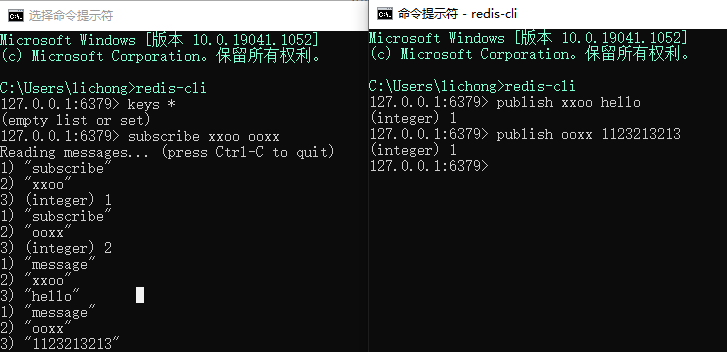

# Redis 特性

## Redis 通道

支持多个操作在一次请求中被执行，如果每个操作都需要访问一次redis服务，会带来额外的消耗。  
客户端和服务器通过网络进行连接。这个连接可以很快（loopback接口）或很慢（建立了一个多次跳转的网络连接）。无论网络延如何延时，数据包总是能从客户端到达服务器，并从服务器返回数据回复客户端。

这个时间被称之为 RTT (Round Trip Time - 往返时间).
当客户端需要在一个批处理中执行多次请求时很容易看到这是如何影响性能的（例如添加许多元素到同一个list，或者用很多Keys填充数据库）。例如，如果RTT时间是250毫秒（在一个很慢的连接下），即使服务器每秒能处理100k的请求数，我们每秒最多也只能处理4个请求。

## Redis 发布订阅

subscribe + publish: redis 会提供一个发布订阅的模式，一个客户端可以订阅一个或者多个通道，当其他客户端在某个通道内发消息的时候，
订阅这个通道的其他客户端都可以收到消息。另外，这个订阅是无关物理存储的，不管你是连接的哪一个数据库，只要订阅了一个通道，那么只要有其他客户端在这个通道上发送消息，你都可以收到。

- 订阅： `subscribe channel [channel...]` 订阅某个通道
- 发布： `publish channel message` 在某个通道上发送消息
- 取消订阅： `unsubscribe channel` 取消订阅某个通道

redis除了提供指定通道的订阅发布，还提供了一种基于通道模式的订阅发布，就是可以订阅符合某个模式的通道

- 基于模式匹配的订阅： `psubscribe pattern` 比如说我们想订阅以xx开头的所有通道，那么可以使用`psubscribe xx*`
- 退订模式匹配：`punsubscribe pattern` 退订该模式的监听，如果没有指定pattern，默认退订所有`psubscribe`指定的订阅

最后，redis还提供了对发布订阅的自检功能，比如想了解一下某个通道的订阅人数，想查看一下当前活跃的通道都有哪些，活跃是指该通道有一个或者多个订阅者。

- 自省命令：`pubsub <subcommand> ... args ...` PUBSUB 是自省命令，能够检测PUB/SUB子系统的状态。它由分别详细描述的子命令组成

这里我验证了一个问题，我一个客户端A使用的是基于模式匹配的订阅,订阅了`xx*` 另一个客户端B订阅了`xx1` 然后我是用`pubsub`命令来查看`xx*`模式下有哪些通道时 只显示了`xx1`，即使我又用了一个客户端C向`xx2`
这个通道发了消息，使用`pubsub`查看时仍然只能看到xx1。所以，这里的活跃通道应该是指被一个客户端显式订阅的，模式订阅的不算。

## Redis 事务

不支持回滚，redis的特征就是快速，没必要为了强制数据完整性而放弃这个特征。Redis事务以`MULTI`开启，在该命令的所有命令都会被压入队列等待执行，当收到`EXEC`的时候才会将这些命令一起执行。
那么这样就涉及到了多个客户端在进行事务时哪个事务会被先执行的问题了。如上图两个客户端同时向redis服务器开启事务，但是由于redis的文件处理器时单线程，所以这些命令会被顺序排列。 对于多个事务来说，哪个事务先执行`exec`
,哪个事务的所有命令就会被先执行。这样对于后执行的事务来说，可能会造成脏读。比如A事务写下`get k1`时，k1的值可能是3，但是如果B事务先执行了`incr k1`,
那么后执行的A事务是从incr的基础上得到的k1。假如我们不想得到变化之后的k1,我们就想得到没有改变的k1，或者说哪怕知道k1有无改变也能接受。那么，我们可以使用`watch k1`去监视k1的变化。

- watch: 监视key的命令，在开启事务之前就对某个key进行watch，当在事务执行的时候，如果key与监视的时候不一致了，那么本次事务就不会执行。
- multi: 开启事务，客户端通过该命令开启一个事务，在该命令之后的所有命令都会压入一个队列，等待执行。
- exec: 该命令触发并执行事务中的所有命令。当客户端使用`multi`开启事务后，却又与服务端口连接，没有执行`exec`，那么事务中的所有命令都不会执行。 另一方面，当成功开启事务，并且执行`exec`
  ，那么事务中的命令都会被执行。这也是事务的原则，要么都执行，要么都不执行

  > 当使用 AOF 方式做持久化的时候， Redis 会使用单个 write(2) 命令将事务写入到磁盘中。 然而，如果 Redis 服务器因为某些原因被管理员杀死，或者遇上某种硬件故障，那么可能只有部分事务命令会被成功写入到磁盘中。 如果 Redis 在重新启动时发现 AOF 文件出了这样的问题，那么它会退出，并汇报一个错误。 使用redis-check-aof程序可以修复这一问题：它会移除 AOF 文件中不完整事务的信息，确保服务器可以顺利启动。 从 2.2 版本开始，Redis 还可以通过乐观锁（optimistic lock）实现 CAS （check-and-set）操作，具体信息请参考文档的后半部分。

- discard: 当我们开启事务之后，所有的命令都会被压入队列，但是这时候如果我们不想执行事务了，那么我们可以使用`discard`指令来打断本次事务。使用`discard`会清空事务中所有的命令并放弃本次事务的执行。

### 事务错误

在执行事务的过程中可能会出现两种错误：

- 事务在执行`exec`前，入队的命令可能出错，比如语法错误，或者是内存不足等。
- 事务在执行`exec`后，命令在执行的时候出错了。

对于第一种错误，Redis2.6.5之前，redis-cli会对入队的命令的结果进行检查，如果返回`QUEUED`则入队成功，继续。 否则就入队失败，一般来说，如果有命令入队失败，就会取消本次事务。
但是在Redis2.6.5之后。redis客户端会对入队出错的命令做记录，在执行`exec`时发现有出错的命令就撤销该事务。  
对于第二种错误，在 Redis2.6.5 以前， Redis 只执行事务中那些入队成功的命令，而忽略那些入队失败的命令。
而新的处理方式则使得在流水线（pipeline）中包含事务变得简单，因为发送事务和读取事务的回复都只需要和服务器进行一次通讯。 至于那些在 EXEC 命令执行之后所产生的错误， 并没有对它们进行特别处理：
即使事务中有某个/某些命令在执行时产生了错误， 事务中的其他命令仍然会继续执行。

### Watch

> WATCH 使得 EXEC 命令需要有条件地执行： 事务只能在所有被监视键都没有被修改的前提下执行， 如果这个前提不能满足的话，事务就不会被执行。
> WATCH 命令可以被调用多次。 对键的监视从 WATCH 执行之后开始生效， 直到调用 EXEC 为止。

## Redis 作为数据库

Redis作为数据库有两种数据恢复策略，或者说有两种数据备份策略，一种是快照RDB,一种是增量式日志文件AOF

### RDB

想象一下，如果你需要备份redis某个时点的数据，比如说8点，那么如果想要将此刻内存中的所有数据都持久化到磁盘该如何去做？ 正常来说，我们需要阻塞进程，来阻止其他进程对redis的数据进行修改。这样我们才能保证数据全都正确的落在磁盘上。  
但是这样合理吗，通过阻塞来完成持久化，代价是无法提供服务，这显然是客户无法接受的。但是如果不进行阻塞，那么比如说我从8点开始持久化数据，
到8点30分，完成数据持久化，这30分钟时间内不断有数据发生修改。那么我们是无法保证8点30分的数据和我们在此期间落入磁盘内的数据是一致的。  
既然无法保证8点到8点30分的数据一致性，那么我们只保存8点这个时刻的数据状态如何？在8点触发数据持久化操作时，redis给此刻的内存中的数据做一个快照。
我们只需要将这个快照全量落入磁盘，那么对我们来说，8点的数据就完成了持久化。至于8点以后的数据等下一次操作时再进行持久化就好了。

那么这里有个问题，我们该如何将快照的数据全量写入磁盘？ 有两种形式可以主动进行数据备份：`save`,`bgsave`。

- save: 阻塞式备份，但一般不使用，因为该命令会阻塞所有客户端的请求，但是该命令并非没有用处，它一般可以在 我将要停止服务，关机维护的时候使用。
- bgsave:redis的做法时通过fork来创建一个子进程，让子进程去完成数据持久化这个操作的。子进程在调用wirte的时候会将数据写入系统的缓冲区中，之后将缓冲区的数据落入磁盘的操作就是 操作系统来完成的了。

除此之外，还有一些操作会触发redis进行RDB操作：
- 配置文件中做一些配置，`save [seconds] [changes]` 来让redis自动触发`bgsave`。这些配置是以 `save` 开头的，但确实是`bgsave`操作的触发阈值
- 进行主从复制时，从库全量复制主库的数据时，会触发主库执行`bgsave`
- 执行指令`flushall`,清空数据库数据时，会触发rdb
- 执行指令`shutdown`,关闭redis服务时，会执行`save`

学过操作系统的同学们都知道，子进程可以共享父进程的数据， 但是这里有个点需要注意，这种数据共享并不是拷贝得来的，比如说父进程内存使用10G，如果子进程也分配10G的空间来存储这些数据，空间资源的消耗是极大的，也没有这个必要。
因此，这里借助了操作系统中的一个机制：`写时复制`。即，父子进程在一开始时通过引用指向共同的内存区域来实现数据共享，当某个进程想要修改数据时， 操作系统会分配一块额外的空间给这个进程来完成对某个元素的修改，同时将该进程对这个元素的引用指向新的空间。

但是这里还有一个问题，就是数据丢失问题，如果redis出问题了，那么最多会丢失多少数据？ 我们稍微想一想就可以得出，会丢失两个时点之间的数据，
比如说8点进行了一次快照备份，在9点之前redis挂掉了，那么这个期间的数据就全部丢失了。
为了减少数据丢失的情况，我们可以在

### AOF
为了解决数据丢失的问题，可以使用AOF这种方式来做数据的持久化，AOF:(append only file)，AOF默认时关闭的，开启AOF之后，redis会通过增量追加写操作到`aof_buf`缓冲区中，等待操作系统将其写入文件，落入磁盘，来进行数据的备份。当我们记录了所有的写操作，进行数据恢复时只需要执行所有的写操作，那么最后得到的数据就是准确的数据了。
 
但是这里有个问题，就是也许我们会对相同的key做多次写操作，但是对我们而言，实际上真正有用的只是最后一次写操作。那么之前的写操作实际上是一些被覆盖的无用操作，记录这些写操作不仅会增加文件的大小，还会在恢复数据时进行无效操作。
所以为了解决这个问题，redis可以使用的是重写aof文件，触发机制分为手动和自动：
- `bgrewriteaof`：执行该指令，进行手动重写，即将写操作通过重写合并来压缩文件大小。注意，rewrite这个操作并非是遍历已经写好的aof文件来来进行，而是fork一个子进程，然后根据当前服务器的数据状态来进行。
- 通过配置文件：`auto-aof-rewrite-percentage 100`和`auto-aof-rewrite-min-size 64mb`。这两个字段来配置redis自动触发重写AOF文件的阈值。表示当AOF的文件大于64mb，且当前AOF的文件大小比上一次重写时的AOF文件的大小大了一倍(100%)时，触发`bgrewriteaof`。

关于重写期间，新的数据写入的问题，父进程会将新的写入指令放到aof-rewrite-buf中，在重写完成之后，追加到新的AOF文件中去。

### 数据恢复
redis4.0之后可以使用RDB+AOF的混合模式了，即时点备份+时点之内的数据进行追加。

- 如果开启了aof，在redis进程挂了，重启后直接使用AOF文件来进行数据恢复
- 如果是redis所在是主机挂了，那主机重启之后，启动redis进程之后会使用AOF文件来进行数据恢复。

