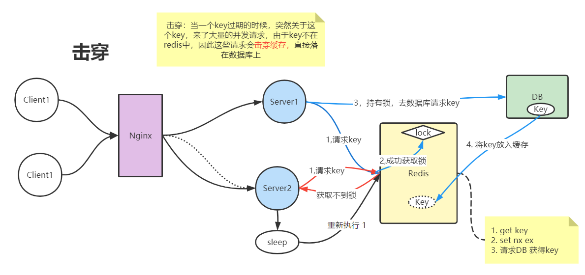
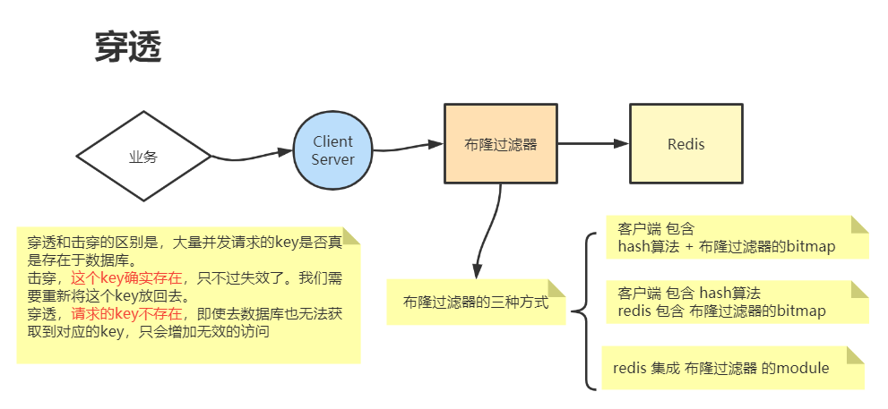
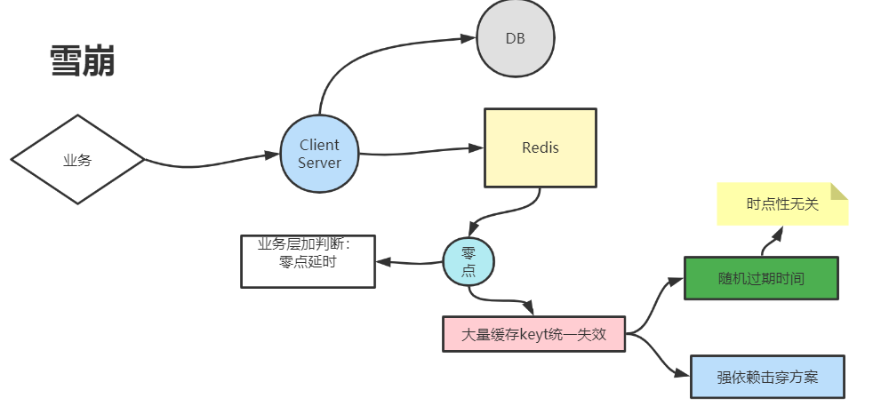

## 击穿

首先我们需要知道什么说击穿的场景，不要搞混这个场景:   
击穿是指，当缓存中的某个key失效的时候，这时候对于这个key发生了大量**并发请求**。 如果这时候不做处理的话，这些并发请求就会越过缓存，落到数据库层，这样数据库会承受较大的压力。

解决方案： 由于redis是单线程单实例的，所有的请求都会在redis中排队执行，为了防止大量请求落到数据库， 我们需要在redis这层将这些请求拦截住。那么这时候我们可以设置一个**分布式锁**，所有线程会进行以下步骤：

1. 获取key的value
2. 如果key不存在，则获取分布式锁
3. 第三步有两种结果  
   3.1 成功获取分布式锁的客户端，去请求数据库  
   3.2 获取不到锁的客户端，随机等待（sleep）一段时间  
4. 如果持有锁的客户端，访问完数据库，会将key对应的value放入redis中。
   其他的客户端在睡眠结束之后，重新进行整个流程。要么获取到已更换新的key，
   要么是刚才的客户端挂了，下一个客户端在接替持有锁。

## 穿透
穿透问题和击穿问题一定要区分开，两者并不等同。所以应对的方式也是不一样的。  
穿透问题是，大量并发请求访问并不存在的key，这些key不会在缓存中，也不会在数据库中。  

解决方式，使用布隆过滤器，但是布隆过滤器解决不了数据改动问题，即无法解决数据删除，它之后在bitmap上增加标记。  
所以可以使用布谷鸟过滤器。

## 雪崩
雪崩问题：雪崩问题和击穿问题的区别是，击穿是少量的key失效之后来了大量并发请求导致的。雪崩问题是大量key失效了，
每个key的少量并发请求集中在一起时可能会发生的。当少量的key失效，且并发请求并不多的时候，其实我们不需要过多关注，
雪崩问题用击穿的解决方案效果并不好，因为每个key分摊的并发请求可能并不多，设置多个分布式锁意义不是很大。但又不能
不去处理。
