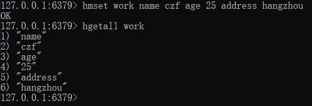
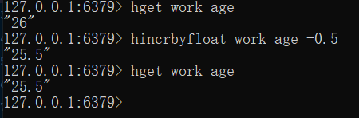

# Redis

## IO模型+epoll

Redis的文件处理器是单线程，这也就决定了redis是串行处理请求的（现在可以做到并行了？）。Redis接受IO请求的处理器是多线程的，即IO可以同时接受多个请求。
使用的模型是多路IO复用选择器，使用是Epoll这种多路选择器。epoll的模型在IO中学过，相比于Selector和Poll, Epoll省略了在每次都对所有的Event进行全量遍历的过程。Epoll在系统调用层面分别有：

1. epoll_create: 在内存中开辟一块缓存空间，用于生成一颗事件红黑树。
2. epoll_ctl: 会接受事件及动作，将对应的socket的文件描述符维护到红黑树中，并通过状态迁移将所有具有IO事件的fd添加到一个集合中去
3. epoll_wait: 从事件集合中读取所有需要处理的fd

## 数据类型

redis相较于memcache的数据类型更完善，尽管对于memcache来说，将存放的数据组织成json结构的数据格式的话，用起来也可以模拟多种数据类型，set。
但是关键问题是，如果用户只想取某个list中的一个元素，而非整个list，那么memcache就无能为力了，它只会将整个list交给用户，
让用户自己取处理。所以与其说是redis提供了多种数据类型，不如说redis提供了对这些数据类型操作的`方法`。
redis可以让用户在集合中的元素中拿出想要的那一个，也可以直接对某个元素做出修改而不是要将元素取出，修改，存入。有点类似`计算向数据移动`
这个概念。  
redis的数据类型如下：

- String: 可以是字符串，也可以是数字，还可以是bitmap，redis是二进制安全的，它会将这些数据存储成二进制的格式，只有生产和消费的双方编码格式相同， 那么就可以获取到统一的数据。
    1. 字符串：
    2. 数字
    3. bitmap
- List: 集合，redis通过提供集合这种类型来做到为一个key存储多个元素，redis为list这种value的数据结构提供了两个指针: head与tail（头指针，尾指针）。
  基于这两个指针，redis可以将list来当作多种数据结构来用
    1. 栈：使用同向命令来进行读写数据，可以模拟栈的操作`lpush`+`lpop`或者`rpush`+`rpop`
    2. 队列：使用反向命令来读写数据，可以模拟栈的操作`lpush`+`rpop`或者`rpush`+`lpop`
    3. 数组： 对于list，redis还提供了使用下标来对元素进行操作，只不过通常redis提供了两套下标 （正向下标从0开始正向增长，反向下标从-1开始逆向增长）`lset key [index] [value]`。
       注意，该命令的l不是指left了，而是指list。
    4. 阻塞单播队列，list还提供了阻塞的操作，以`b`开头，来支持阻塞操作。但是目前支持三个命令`BRPOP`,`BLPOP`,`BRPOPLPUSH`
- Hash: value为一个hashmap，我们可以为一个key设定多个hashmap,只要每个hashmap的key不冲突就不会被覆盖。而且redis也支持对value的value进行数值计算。  
  场景： 点赞（对哪些内容进行过点赞），收藏（收藏了哪些内容），详情页（某个人多个特点归结）

- Hash: 当我们需要通过多个属性来确定一个value时，可以如何去做呢？也许我们可以使用String类型， 将不同的key通过一个连接符连接之后在查询的时候查询对应的String即可。  
  比如说我添加了一个worker，我通过`::`来连接worker的属性，增加了`worker::name`,`worker::age`,`worker::address`。如果我想获取这个worker的name
  那么我只要获取`worker::name`对应的值就可以了。但是如果我想获取worker的全部属性呢，那我先要知道worker对象都包含哪些属性。然后再根据这些属性去取值。
  这样与服务多了一个获取属性名的过程了。但是如果我们使用了`hash`,我们可以如下定义：
    
  我们需要获取一个hash的value 需要两个值，一个是key，一个是filed。另外如果hash->filed的value是数字类型，我们还可以进行加减运算：  
  
  应用场景：
    1. 点赞的内容，设置一个key来作为你的点赞，然后不同的filed作为点赞名，value是点赞内容
    2. 收藏的内容：设置一个key来作为你的收藏，然后不同的filed作为收藏名，value是收藏内容
    3. 详情页：将给物品的详情的不同属性通过hash来存储
  
- set: 首先考虑，set与list有什么不同，它们的区别决定了它们的定位和使用的业务场景。list是根据插入顺序排序的线性集合，元素可以重复。 set是`无序`，`去重`的元素集合。那么我们可以如何使用set呢？
    1. 无序，去重： 做去重统计
    2. set可以进行集合操作；交集，并集，差集：这个可以用的业务员场景很多，比如做共同关注，共同粉丝，推荐朋友等
    3. 随机获取：`SRANDMEMBER key [count]` count的取值可以是正数，负数，0  
      1. 正数：返回去重的元素集合,返回的数量最多为本身。  
      2. 负数：返回不去重的元素集合，返回数量一定等于指定数量的绝对值
      3. 0：返回空
       
       场景： 抽奖，从粉丝集合选出奖品个数的人（人数大于奖品，参数为正，表示一个人最多获取一个奖品）；  
       或者返回奖品个数的粉丝（奖品大于人数，参数为负，表示一个人可以获取多个奖品）。
- zet: 
