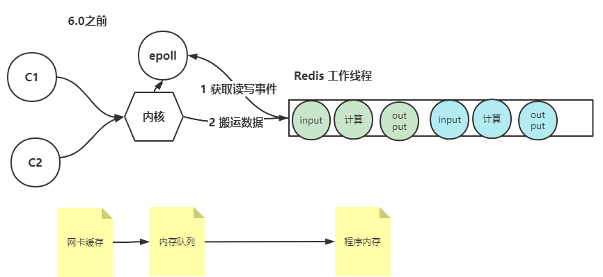

# Redis 面试题

## 介绍一下项目中redis的使用场景

1. 从redis的五种类型说起，String,List,Hash,Set,ZSet。如果项目中有用到的话可以聊一聊： String->bitmap 存储油站控制器离线情况 Set->油站字典 Hash-> （油站基础信息）
2. 缓存，缓存热点数据，比如说油站基础数据， 待匹配的交易数据。 redis主要是用来做缓存，因为它快速，追求性能。 因此可以适当放弃一些数据一致性的要求。
3. 使用redis来实现服务的无状态，这个不好说。

## redis是单线程还是多线程的

1. 首先要明确，不管什么版本，redis的工作线程都是只有一个。
2. 高版本中，6.x以上的redis，提供了多个IO线程来加快数据IO效率，可以更好压榨操作系统和硬件（如网卡）的能力。  
     
   首先明确一个事情，redis作为一个服务，是从内核的缓冲区将需要的数据搬运到自己的内存的。而OS的内核中使用的IO模型一般都是多路io选择器的模型。 其中又以epoll这个选择器更为优化。  
   客户端C1,C2是先与OS建立socket连接，然后有数据来的时候，epoll就会读到这写IO事件，注，epoll只负责获取读写事件，不负责事件处理和数据读取。
   redis的工作线程从epoll得知了有哪些客户端发来数据了，然后就会取内存缓冲区中把这些数据搬运到自己的内存中。  
   另外我们可以认为一个redis的一个单指令的执行是原子的。而单指令又可以分为三个步骤：input，计算和output。

   
   在高版本中（6.x）中，redis抽出了多个IO线程来处理IO事件。这样的话，从客户端获取数据和将数据写回的操作都交给IO线程来做。 而在工作线程上只发生计算行为。
   设想一下，同样是两个客户端并发访问redis，在低版本中，每个指令的三个操作都是由工作线程来完成的。 工作线程从epoll上知道两个客户端发来请求了，但是他需要一个个的去缓冲区拿数据，放到自己的内存中，发生计算，然后在放回去。
   但是，现在有两个IO线程可以帮我们来处理IO事件了。工作线程从epoll中得知两个客户端有发来数据，然后指定两个IO线程取读取数据，
   IO线程将读到的数据放到堆上（栈独享，堆共享）。然后工作线程拿到数据发生计算，然后再放回，IO线程得知计算完了之后，将结果返回。

   多个IO线程的优势：
   - 更大限度上压榨了OS和硬件的能力，因为数据是先放到网卡缓存，然后进入内存的Queue，之后被搬运到程序内存中的。多个IO线程提高了这个过程的吞吐量。
    
    关于执行顺序：redis可以保证一个客户端提交的指令顺序执行，但是无法保证多个客户端提交的指令的执行顺序，因为这个IO线程先读哪个指令无法保证。
## 缓存击穿，穿透，雪崩的解决方案
   简述一下，具体看 [Redis 解决缓存问题](redis-解决并发缓存问题.md)  
   - 击穿：DB存在这个key，但是失效了（过期或压根没存），针对这个key大量请求打过来，击穿了缓存层，落到数据库上。  
     解决措施： 1. 尝试获得key 2. 获取不到key，去获取锁 3.1 拿到锁，去数据库拿，放缓存 释放锁，3.2 拿不到锁，随机睡眠/降级返回。 4 重试，重复1-3过程。
     
  - 穿透： 数据库压根没有这个key，缓存中也不会存在这个key。
    解决措施： 
    1. 类似击穿方案，只不过获取锁的线程再查不到数据的时候将 key null 放入缓存。
    2. 布隆过滤器，概率性过滤，可能存在误判。另外只能数据删除或者变动时无法将之前的映射消除。因为不知道是否有其他key也映射到了bitmap上的这一位。
       可以使用布谷鸟过滤器。
       
  - 雪崩： 大量的key失效，可能每个key的访问量不大，但是多个key加载一起就很大了。
   解决措施：
    1. 不涉及到时点失效的，可以使用随机过期时间
    2. 涉及到随机失效的，只能是使用强依赖的击穿方案。就是使用锁来解决击穿的方案，但是需要结合业务。
   
## Redis如何淘汰过期的keys  

## 缓存预热

## 数据库与缓存不一致怎么办

## 简述一下主从不一致的问题

## redis持久化原理

## redis持久化方式

## redis事务