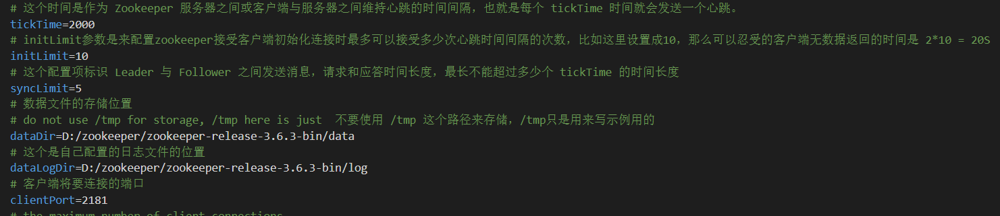

## Windows 环境

windows环境下装高版本的zookeeper可能会遇到一些坑  
下载连接: [https://zookeeper.apache.org/releases.html](https://zookeeper.apache.org/releases.html)  
这里需要注意的是，高版本的zookeeper需要下载文件名带有`-bin`的压缩文件，不带`-bin`的是源码。另外，我之前在github上找到的
zookeeper的源码仓库，里面版本对应的tag有个`.zip`的文件，里面是源码文件，是没有编译好的源码，你如果运行了`zkServer.cmd`会
提示你 `错误: 找不到或无法加载主类 org.apache.zookeeper.server.quorum.QuorumPeerMain`。

### 修改配置文件
1. 去`\conf`路径下，复制`zoo_sample.cfg`，该名为`zoo.cfg`。这个一定要改，应该是源码中在加载配置文件的时候指定的是conf目录下的zoo.cfg文件了
   
2. 修改配置文件中的数据文件和日志文件的路径。
   
3. bin目录下几个脚本文件，依次点击打开。但是这里有个小坑，就是配置文件的命令脚本，里面看起来是配置各种变量的。
   

注： 如果启动起来闪退的话，可能是因为没有配置java的环境变量导致命令脚本在运行时找不到对应的环境变量。  
  
另外，如果我们想要排查启动错误的话，可以在命令脚本文件里面在合适的位置，添加`pause`这行命令阻塞中执行，来查看问题原因。

## Linux环境

暂时没有安装虚拟机，之后更新