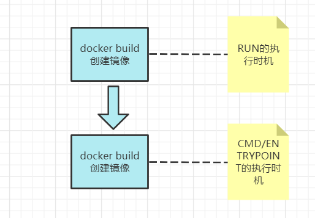
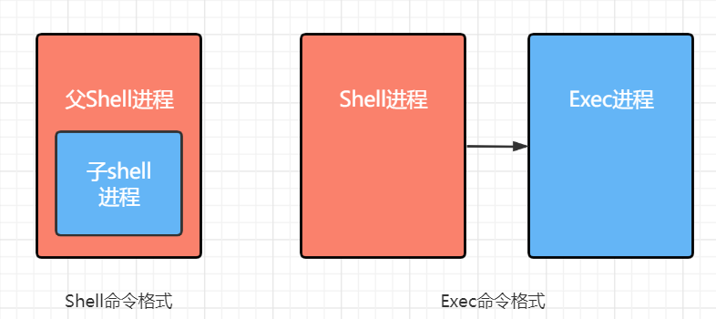
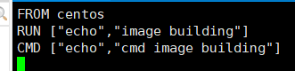
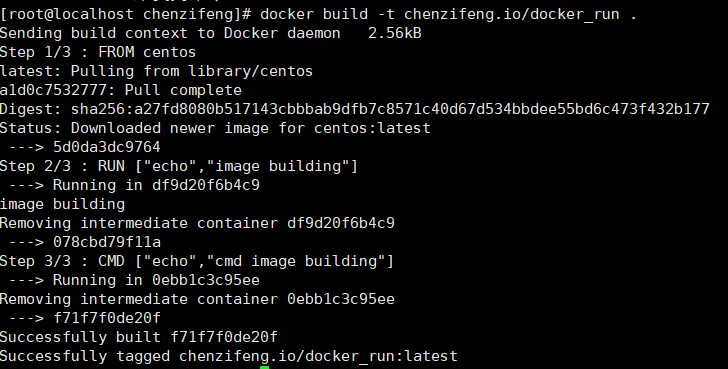
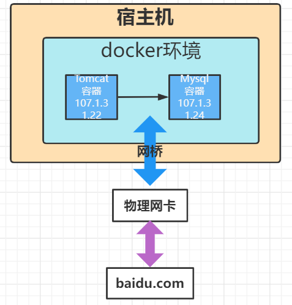

# docker

Linux 安装 （以Centos为例）：

官方文档[doecker CentOS安装](https://docs.docker.com/engine/install/centos/)

## 安装步骤

1. 卸载掉旧版本的`docker`以及`doceker-engine`

   ```shell 
   sudo yum remove docker \
                     docker-client \
                     docker-client-latest \
                     docker-common \
                     docker-latest \
                     docker-latest-logrotate \
                     docker-logrotate \
                     docker-engine   	
   ```

2. 安装yum工具包`yum-utils`,这个工具包可以帮助我们来更好的安装我们所需要的软件

   ```shell
   sudo yum install yum-utils
   ```

3. 使用`yum-config-manager`来添加docker对应的安装源

   ```shell
   sudo yum-config-manager \
       --add-repo \
       https://download.docker.com/linux/centos/docker-ce.repo
   ```

   这里需要注意的是，`--add-repo` 是设置新的安装源，官网上的安装源默认的是国外docker服务器上的源。我们这里可以使用阿里云的安装源。另外`docker-ce`的后缀`ce`
   表示当前版本是社区开源版，如果是企业收费版则后缀名应该是`ee`。

4. 安装docker，命令比较简单

   ```shell
   yum -y install docker-ce	
   ```

5. 启动docker

   ```shell
   service docker start
   ```

6. 验证docker是否安装成功

   ```shell
   docker version
   ```

   docker会将服务端和客户端同时安装好，默认docker的客户端连接的是本地服务端

7. 验证docker是否能运行,验证方法是从docker服务端拉取一个demo镜像文件。

   ```shell
   docker pull hello-world
   ```

   基于hello-world这个镜像文件创建对应容器

   ```shell
   docker run hello-world
   ```

### 设置阿里云的加速代理

去阿里云中查找`容器镜像服务`->`镜像加速器`

这里配置的时候需要注意docker的安装版本是否符合要求。

   ```shell
   sudo mkdir -p /etc/docker
   sudo tee /etc/docker/daemon.json <<-'EOF'
   {
     "registry-mirrors": ["https://*******.mirror.aliyuncs.com"]
   }
   EOF
   sudo systemctl daemon-reload
   sudo systemctl restart docker
   ```

### Tomcat

Tomcat:lastest 容器内部结构，包括三部分
- Linux(Red Hat4.8.5-28) : Linux对应的版本非常轻量，不会带来太多负担，甚至轻量化到只能支持容器内的其他组件。
  但是正是由于有这个操作系统的存在，对于资源的控制和操作就有了保障。
- jdk(1.8.0_222)
- Appche Tomcat/8.5.46

### 在容器中执行命令：

- docker exec [-it] 容器id 命令
    1. exec 在对应容器中执行命令
    2. -it 以交互式的方式执行命令，即如果我们后期需要在这个基础上对容器执行其他命令  
   实例： docker exec -it ******** /bin/bash
       
### Dockerfile 镜像描述文件

- Dockerfile是一个包含 用于镜像的命令 的文本文档
- Docker 通过读取Dockerfile中的指令 按步自动生成镜像
- 用于构建镜像的命令： `docker build -t 机构/镜像名<:tag> Dockerfile目录`

### Docker自动部署Tomcat应用
对应Dockerfile里面的内容，
- FROM tomcat:lastest  # FROM 用于构建基础镜像
- MAINTAINER xxx.com  #  说明当前镜像 是由哪个人或者机构来维护的
- WORKDIR /usr/local/tomcat/app # 切换工作目录
- ADD docker-web ./docker-web

docker build -t  机构名或者个人id/镜像的名字:版本 /目录（绝对或者相对路径）

# 镜像分层
docker每执行一步dockerfile的命令都会创建一个快照，这个快照是以临时容器的方式存在的。可以认为每个临时容器
都是当时系统的快照。这些临时容器是可以重用的，即创建不同镜像容器的时候，可以重用之前载入过的临时容器。
    
## Dockerfile基础命令
- FROM: 基于基准镜像，这个是每个dockerfile必须有的命令。
  1. FROM centos  # 基于centos这个基础镜像进行构建
  2. FROM scratch # 不依赖任何基础镜像，从零构建  
  注  尽量使用官方的base image，尽量不要使用来临不明的基础镜像
     
- LABEL & MAINTAINER： 说明信息，对镜像进行描述 并不会产生实际的功能信息
  1. MAINTAIER: 表明该镜像的维护组织或者个人  
  2. LABEL version="1.0:  
  3. LABEL description="镜像描述"
  
- WORKDIR 设置工作目录
  1. WORKDIR /home/work
  2. WORKDIR /home/work/newdir # 具有创建目录的作用  
   建议: 尽量使用绝对路径    

- ADD & COPY 复制文件 （两者功能有重合）
  1. ADD hello / #复制hello到根目录
  2. ADD test.tar.gz / #添加到根目录并进行解压
  3. ADD 除了复制，还具备添加远程文件的功能
    
- ENV 设置环境常量
  1. ENV JAVA_HOME /usr/local/openjdk1.8
  2. RUN ${JAVA_HOME}/bin/java -jar test.jar # 可以通过${}来引用设置过环境常量  
  注： 尽量使用环境常量来提高程序的维护性   


## docker 启动命令
  
- RUN： 在build构建时执行，一旦镜像被创建之后，就是只读的，不允许被修改了。
  RUN命令是在创建镜像时，修改镜像内部的文件和资源
- ENTRYPOINT/CMD：在创建容器时，在容器内部执行命令

### RUN

- Shell命令格式： RUN yum install -y vim
  1. 使用shell执行时，当前Shell是父进程，生成一个子Shell进程
  2. 脚本命令会在子shell进程中执行，执行完毕之后退出子shell返回父进程shell，不会对父进程产生影响  
- Exec格式： RUN ["yum","install","-y","vim"]
  1. 使用Exec方式执行，会创建Exec进程替代当前Shell进程，并保持PID不变
  2. 执行完毕之后，直接退出，并不会退回到之前的进程环境中
    
推荐使用Exec的方式来执行命令

### ENTRYPOINT
1. ENTRYPOINT（入口）用于在创建容器时执行命令
2. Dockerfile中如果包含了多个ENTRYPOINT，则只有最后一个ENTRYPOINT会被执行

例：  ENTRYPOINT ["ps"] #推荐使用Exec命令格式

### CMD 默认命令
1. CMD设置默认执行的命令
2. Dockerfile中出现多个CMD，默认最后一个会被执行
3. 如果容器启动时附件命令，则CMD被忽略

例： CMD ["ps","-ef"]

注： ENTRYPOINT一定会被运行，而CMD不一定会被运行

## demo
1. 创建一个Dockerfile,注意Dockerfile大小写敏感 `vim Dockerfile`  
  
   内容很简单：基础镜像是centos，执行两个打印命令
   
2. 使用写好的Dockerfile构建镜像 `docker build -t chenzifeng.io/docker_run .`

   
我们可以注意看一下，构建镜像的过程分为了散布，对应Dockerfile中的三个命令，其中RUN命令是被执行了，而CMD命令则没有执行

## 构建一个Redis镜像
1. DockerFile:
    ```dockerfile
    FROM centos
    RUN ["yum","install","-y","gcc","gcc-c++","net-tools","make"]
    WORKDIR /usr/local
    ADD redis-xx.tar.gz
    WORKDIR /usr/local/redis-xx/src
    RUN make & make install
    WORKDIR /usr/local
    # 将redis-7000配置文件复制到当前目录下
    ADD redis-7000.conf .
    # 暴露7000端口
    EXPOSE 7000
    CMD ["redis-server","redis-7000.conf"]
    ```
   
2. 构建镜像 `docker build -t chenzifeng.io/docker-redis .`
   docker会按照Dockerfile书写的文件进行构建
   
3. 构建容器 `docekr run -p 7000:7000 chenzifeng.io/docker-redis`

4. 可以通过 `docker ps` 来查看正在运行的容器

注 ：redis已经提供了对应的官方镜像，可以直接从docket hub上直接拉取

## 容器间Link单向通信
当容器创建时会生成自己的虚拟IP，外界是无法通过虚拟IP来访问对应容器的，但是同一个docker环境下的各个容器
可以通过虚拟IP来访问彼此。  
但是这里有个问题，虚拟IP每次创建容器都会生成，如果使用虚拟IP进行互通，那么很有可能会因为容器的上下线导致IP改变而出问题。  
我们可以通过给容器命名，这样通过容器名称来进行通讯的时候，docker会根据容器名字就行动态连接
`docker run -d --name [container-name] container`  
之后我们可以使用`docker inspect [container-id]`来获取对应容器的元数据信息

## 容器间双向通-Bridge网桥


1. 网桥充当了docker环境与宿主机之间的通信源。docker中的容器可以通过网桥与物理网卡进行通信，即可以与外界网络进行通信。
  同时外界网络也可以通过网桥访问到docker环境
   
2. 网桥另一个作用：对容器在网络层进行分组：将多个容器绑定到同一个网桥上，那么这一组容器之间就可以天然的进行互联互通。

命令如下：

- docker network ls : docker network是docker网路服务层面的命令，跟ls可以列出docker当前底层网络服务的明细

- docker network create -d bridge [bridge-name] :创建并命名一个网桥服务

- docker network connect [bridge-name] [container-name] : 连接网桥和容器，或者说将容器绑定到该网桥上


## Volume容器间共享数据
当我们多个容器之间需要进行数据共享时，比如说，多个tomcat容器都有同一个web页面，如果不做数据共享，那么当web页面发生变化时，
就得一个个容器进行替换，这样就比较缺乏效率。
volume的实际上是在宿主机的磁盘空间中开辟一块空间来存在数据，使得不同容器都可以引用上面的数据进行共享

### 通过设置-v 挂载宿主机目录
- 格式: docker run --name 容器名 -v 宿主机路径:容器内挂在路径 镜像名
- 实例: docker run --name t1 -v /usr/webapp/:/usr/local/tomcat/webapps tomcat

这样所有在宿主机对应目录下的文件的改变都会使对应的容器目录下的文件改变，或者说通过-v让容器对应路径上的文件指向了宿主机的路径文件
但是这种方法比较麻烦的地方就是，在书写 宿主机路径和容器内对应路径的挂在关系时，错一点都会使挂载失败
### 通过设置--volume-from共享容器内挂载点
1. 创建共享容器  `docker create webpage -v /webapps:/tomcat/webapps tomcat /bin/true`  
  创建一个容器，这个容器本身只是被创建出来，并不运行。这个命令的主要目的就是定义一个挂载点
2. 共享容器挂载点  `docker run --volume-from webpage --name t1 -d tomcat`    
   创建一个运行容器，并申明该容器的挂载点为共享容器webpage。
   
我理解的是相比于第一种方法，其实第二种方法像是定义了一个常量容器，来作为挂载点信息

## 容器编排工具 docker-compose

- Docker-compose： 单机多容器部署工具
- 通过yml文件定义多容器如何部署
- WIN/MAC默认提供docker-compose，linux需要手动安装
m


