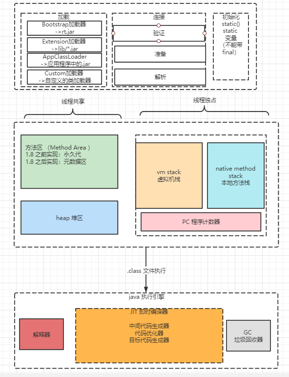

## 聊一下JVM的内存模型

## 聊一聊GC

1. 分代模型：为什么要分代，怎么分代
2. 垃圾寻找算法：引用计数，根可达
3. 常见的垃圾回收器及其组合 erial + Serial Old / PS+PO / CMS+ParNew
4. 常见的垃圾回收算法：标记清楚 拷贝复制 标记压缩
5. CMS过程：初始标记->并发标记->重标记->并发回收
6. 并发标记算法：CMS 三色标记  G1 三色标记+（）  ZGC 染色指针

## 如何解决线上GC频繁的问题
1. 了解问题时间点和当前FGC的频率
2. 查看问题时间点前有无版本上线或者组件升级（通过查看版本记录来缩小问题出现的范围）
3. 了解JVM参数：包括堆空间各个区域的大小设置，垃圾回收器的组合是否合理。分析是否是JVM参数设置导致的频发GC
4. 进一步对GC原因进行排查：其中元空间被打满，内存泄露，显示调用GC等问题容易排查
5. 针对大对象和生命周期长的对象，通过`jmap -histo`命令结合dump堆存储文件来进一步分析。

## 简述内存溢出的原因及线上如何排查
OOM: 看报错的原因
1. ...java heap space...:堆栈溢出，代码问题可能性较大
2. GC over head limit executed 系统处于高频GC且回收效果不好。考虑是创建了很多无法被释放的对象或者是引用使用不当，或者是申请了大对象导致的
3. Direct Buffer Memory: 直接内存不足，因为JVM的垃圾回收器不会回收直接内存。考虑间接或者是直接使用了ByteBuffer.allocateDirect()方法，而没有clear导致的
4. StackOverFlowError:Xss设置太小，但是很可能是程序问题

## 调优
- Xss: 每个线程分配的虚拟机栈和堆栈大小，一般256K足以，这个的设置会影响java进程中的线程数的多少
- Xms: 初始化时JAVA进程的堆大小
- Xmx: JAVA进程的堆可以扩展到的最大值，很多情况下，通常将-Xms和-Xmx设置成一样的，因为当堆不够用而发生扩容时，会发生内存抖动影响程序运行时的稳定性。

